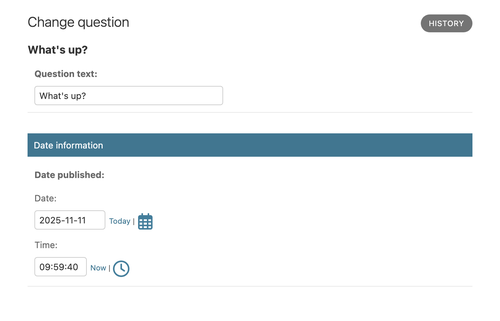
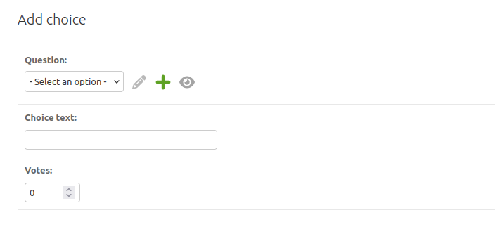
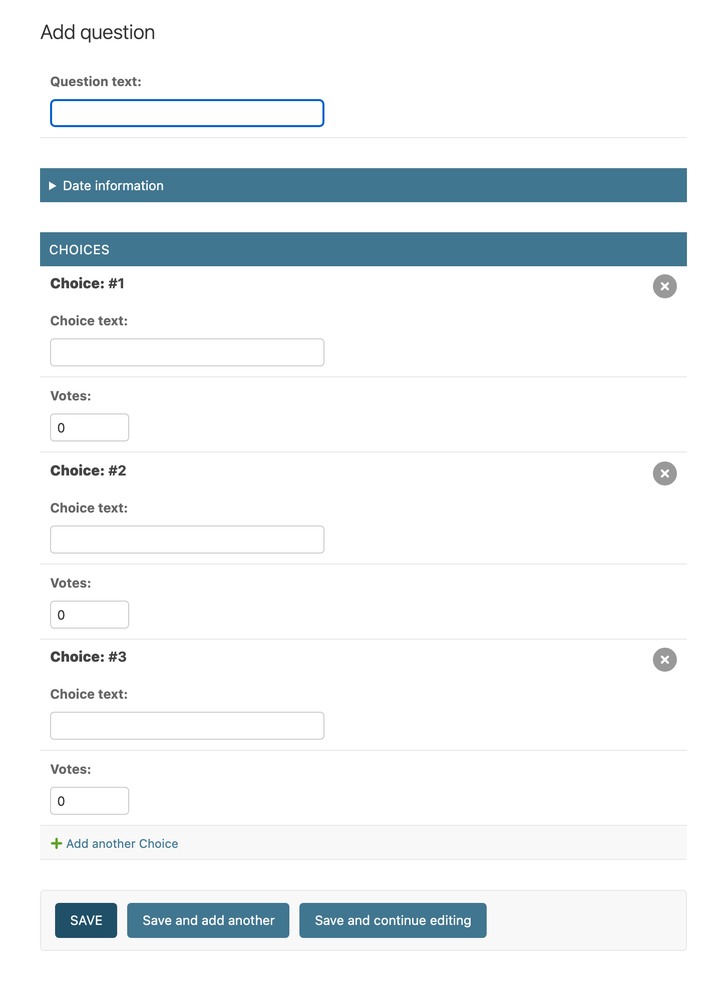
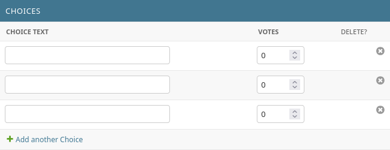
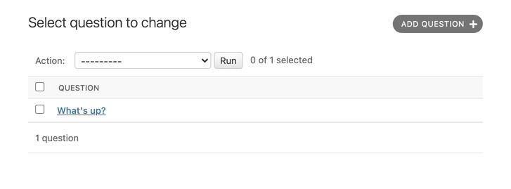
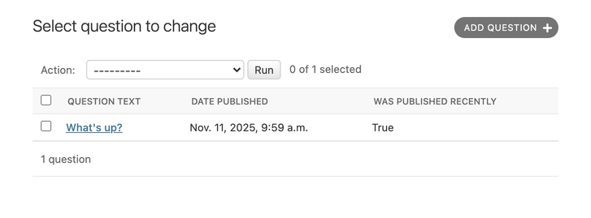
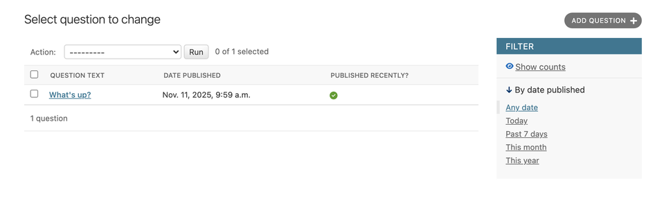

# Table of Contents <!-- omit in toc -->

- [1. Run the existing project](#1-run-the-existing-project)
- [2. Step by step guide from scratch (for Ubuntu or wsl)](#2-step-by-step-guide-from-scratch-for-ubuntu-or-wsl)
  - [2.1. Install python (if still not)](#21-install-python-if-still-not)
  - [2.2. Create venv (virtual environment)](#22-create-venv-virtual-environment)
  - [2.3. Install Django](#23-install-django)
  - [2.4. Create a django project](#24-create-a-django-project)
  - [2.5. Database setup for PostgreSQL](#25-database-setup-for-postgresql)
    - [2.5.1. Install `psycopg` package (https://github.com/psycopg/psycopg/)](#251-install-psycopg-package-httpsgithubcompsycopgpsycopg)
    - [2.5.2. Create database](#252-create-database)
      - [2.5.2.1. enter postgress psql shell](#2521-enter-postgress-psql-shell)
    - [2.5.3. Settings file](#253-settings-file)
    - [2.5.4. Environ variables](#254-environ-variables)
    - [2.5.5. Git commit](#255-git-commit)
  - [2.6. (Optional) TailwindCSS and DaisyUI setup for frontend (not for this project)](#26-optional-tailwindcss-and-daisyui-setup-for-frontend-not-for-this-project)
- [3. CREATING the Polls app](#3-creating-the-polls-app)
  - [3.1. Write your first view](#31-write-your-first-view)
  - [3.2. Creating models](#32-creating-models)
  - [3.3. Activating models](#33-activating-models)
  - [3.4. Playing with the API](#34-playing-with-the-api)
      - [3.4.0.1. Add custom method to model](#3401-add-custom-method-to-model)
      - [3.4.0.2. Back to shell](#3402-back-to-shell)
  - [3.5. Introducing the Django Admin](#35-introducing-the-django-admin)
    - [3.5.1. Creating an admin user](#351-creating-an-admin-user)
    - [3.5.2. Start the development server](#352-start-the-development-server)
    - [3.5.3. Enter the admin site](#353-enter-the-admin-site)
    - [3.5.4. Make the poll app modifiable in the admin](#354-make-the-poll-app-modifiable-in-the-admin)
    - [3.5.5. Explore the free admin functionality](#355-explore-the-free-admin-functionality)
  - [3.6. Django Views](#36-django-views)
    - [3.6.1. Overview](#361-overview)
    - [3.6.2. Writing more views](#362-writing-more-views)
    - [3.6.3. Write views that actually do something](#363-write-views-that-actually-do-something)
      - [3.6.3.1. A shortcut: `render()`](#3631-a-shortcut-render)
    - [3.6.4. Raising a 404 error](#364-raising-a-404-error)
      - [3.6.4.1. A shortcut: get\_object\_or\_404()](#3641-a-shortcut-get_object_or_404)
    - [3.6.5. Use the template system](#365-use-the-template-system)
    - [3.6.6. Removing hardcoded URLs in templates](#366-removing-hardcoded-urls-in-templates)
    - [3.6.7. Namespacing URL names](#367-namespacing-url-names)
  - [3.7. Write a minimal form](#37-write-a-minimal-form)
  - [3.8. Use generic views: Less code is better](#38-use-generic-views-less-code-is-better)
    - [3.8.1. Amend views](#381-amend-views)
    - [3.8.2. Amend URLconf](#382-amend-urlconf)
  - [3.9. Introducing automated testing](#39-introducing-automated-testing)
    - [3.9.1. What are automated tests?](#391-what-are-automated-tests)
    - [3.9.2. Why you need to create tests](#392-why-you-need-to-create-tests)
    - [3.9.3. Basic testing strategies](#393-basic-testing-strategies)
    - [3.9.4. Writing our first test](#394-writing-our-first-test)
      - [3.9.4.1. We identify a bug](#3941-we-identify-a-bug)
      - [3.9.4.2. Create a test to expose the bug](#3942-create-a-test-to-expose-the-bug)
      - [3.9.4.3. Running tests](#3943-running-tests)
      - [3.9.4.4. Fixing the bug](#3944-fixing-the-bug)
    - [3.9.5. More comprehensive tests](#395-more-comprehensive-tests)
    - [3.9.6. Test a view](#396-test-a-view)
      - [3.9.6.1. A test for a view](#3961-a-test-for-a-view)
      - [3.9.6.2. The Django test client](#3962-the-django-test-client)
      - [3.9.6.3. Improving our view](#3963-improving-our-view)
      - [3.9.6.4. Testing our new view](#3964-testing-our-new-view)
      - [3.9.6.5. Testing the DetailView](#3965-testing-the-detailview)
    - [3.9.7. Ideas for more tests](#397-ideas-for-more-tests)
    - [3.9.8. When testing, more is better](#398-when-testing-more-is-better)
    - [3.9.9. Further testing](#399-further-testing)
  - [3.10. Static files](#310-static-files)
    - [3.10.1. Customize your app’s look and feel](#3101-customize-your-apps-look-and-feel)
    - [3.10.2. Adding a background-image](#3102-adding-a-background-image)
  - [3.11. customizing the admin site](#311-customizing-the-admin-site)
    - [3.11.1. Customizing the admin form](#3111-customizing-the-admin-form)
      - [3.11.1.1. Reordering fields](#31111-reordering-fields)
      - [3.11.1.2. Fieldsets](#31112-fieldsets)
    - [3.11.2. Adding related objects](#3112-adding-related-objects)
    - [3.11.3. Customize the admin change list](#3113-customize-the-admin-change-list)
      - [3.11.3.1. `list_display`](#31131-list_display)
      - [3.11.3.2. `list_filter`](#31132-list_filter)
      - [3.11.3.3. `search_fields`](#31133-search_fields)
    - [3.11.4. Customize the admin look and feel](#3114-customize-the-admin-look-and-feel)
      - [3.11.4.1. Customizing your project’s templates](#31141-customizing-your-projects-templates)
      - [3.11.4.2. Customizing your application’s templates](#31142-customizing-your-applications-templates)
    - [3.11.5. Customize the admin index page](#3115-customize-the-admin-index-page)
  - [3.12. Third-party packages](#312-third-party-packages)
    - [3.12.1. Installing Django Debug Toolbar](#3121-installing-django-debug-toolbar)
    - [3.12.2. Getting help from others](#3122-getting-help-from-others)
    - [3.12.3. Installing other third-party packages](#3123-installing-other-third-party-packages)
  - [3.13. How to write reusable apps](#313-how-to-write-reusable-apps)
    - [3.13.1. Reusability matters](#3131-reusability-matters)
    - [3.13.2. Your project and your reusable app](#3132-your-project-and-your-reusable-app)
    - [3.13.3. Installing some prerequisites](#3133-installing-some-prerequisites)
    - [3.13.4. Packaging your app](#3134-packaging-your-app)
    - [3.13.5. Using your own package](#3135-using-your-own-package)
    - [3.13.6. Publishing your app](#3136-publishing-your-app)

# 1. Run the existing project

- install dependencies

  **terminal**

  ```bash
  pip install -r requirements.txt
  ```

- run `migrate`

  **terminal**

  ```bash
  python manage.py migration
  ```

- run dev server

  ```bash
  python manage.py runserver
  ```

- Visit http://127.0.0.1:8000/polls/ to see the poll questions.

[⬆️ Return to Table of contents](#table-of-contents)

# 2. Step by step guide from scratch (for Ubuntu or wsl)

## 2.1. Install python (if still not)

- for ubuntu (wsl)

```bash
sudo apt update
sudo apt install python3 python3-pip python3-venv
```

## 2.2. Create venv (virtual environment)

- Create a venv inside the project directory

```bash
python3 -m venv .venv
```

- immediately add it to .gitignore file

.gitignore

```
.venv/
```

- Activate venv

```bash
source .venv/bin/activate
```

## 2.3. Install Django

```bash
python -m pip install django
pip freeze > requirements.txt
```

- To verify that Django can be seen by Python, type python from your shell. Then at the Python prompt, try
  to import Django:

```bash
python
>>> import django
>>> print(django.get_version())

//output
6.0.6

>>> exit()
```

- Or, run this while activating the venv

```bash
python -m django --version
```

## 2.4. Create a django project

```bash
django-admin startproject project_core .
```

- This will create a project named 'project_core' and 'manage.py' file inside the current directory
- (I will choose the name `config` instead of `project_core` next time)

- Run server to test if everything is okay

```bash
python manage.py runserver
```

- ignore the 'unapplied migration' warning for now.

## 2.5. Database setup for PostgreSQL

- Django comes with `sqlite` db by defalut. But if we want to setup big db engines like PostgreSql, we need to set it up.
- This can be done at the end, but recommended to do at the beginning to avoid any issue

### 2.5.1. Install `psycopg` package (https://github.com/psycopg/psycopg/)

- Install following packages in global system (not in venv)

```bash
sudo apt update
sudo apt install libpq5 libpq-dev python3-dev
```

- OR check if they are already instally (globally)

```bash
dpkg -l | grep -E 'libpq5|libpq-dev|python3-dev'
```

(`ii` - means installed)

- In the project's venv (activating venv), install following

```bash
pip install "psycopg[c,pool]"
pip freeze > requirements.txt
```

### 2.5.2. Create database

#### 2.5.2.1. enter postgress psql shell

open wsl

```bash
sudo -u postgres psql
```

Enter password for `sudo`

- Create db for an existing postgres user
- (DON'T FORGET SEMICOLON FOR POSTGRES SHELL COMMANDS)

```psql
CREATE DATABASE <db_name> OWNER <pg_username>;
```

This will grant all privileges to the user by default

- check if the db is created

```psql
\l
```

### 2.5.3. Settings file

- Install dj-database-url for convenience (https://pypi.org/project/dj-database-url/)

settings.py

```py
import dj_database_url

# modify
DATABASES = {
    "default": dj_database_url.config(
        default="postgres://<db_owner>:<owner_password>@<port>:5432/<db_name>",
        conn_max_age=600,
    )
}
```

- DELETE `db.sqlite3` file
- Run migrate and runserver. See if everything is okay

- For extra check, check if database tables (auth, etc.) are created.

```bash
psql -U <db_user> -d <db_name>
```

This tables are created based on INSTALLED_APPS listed in settings.py

### 2.5.4. Environ variables

- create .env file in the root

```
DEBUG=True
SECRET_KEY=<django_secret_key>
DATABASE_URL=postgres://<db_owner>:<owner_password>@<port>:5432/<db_name>
```

- immediately add .env to .gitignore file

- Generate secret key for django and add it to the .env file

```bash
python -c "import secrets; print(secrets.token_urlsafe(50))"
```

- Install `django-environ` in the venv:

```bash
pip install django-environ
pip freeze > requirements.txt
```

- Modify settings.py to use the envs

settings.py

```py
import environ
import os
from pathlib import Path

BASE_DIR = Path(__file__).resolve().parent.parent

# Initialize environ
env = environ.Env(
    # set casting, default value
    DEBUG=(bool, False)
)

# Read the .env file
environ.Env.read_env(os.path.join(BASE_DIR, '.env'))

# Use the variables
SECRET_KEY = env('SECRET_KEY')
DEBUG = env('DEBUG')

DATABASES = {
    'default': env.db(), # django-environ has dj-database-url built right in!
}
```

- Stop the server, run migrate and server. Check if everything is okay

### 2.5.5. Git commit

- As initial setups have completed, do your first commit (optionally push to a github repo)

## 2.6. (Optional) TailwindCSS and DaisyUI setup for frontend (not for this project)

<!-- ============================END INITIAL DJANGO SETUPS============================== -->

[⬆️ Return to Table of contents](#table-of-contents)

# 3. CREATING the Polls app

- To create your app, make sure you’re in the same directory as manage.py and type this command:

```bash
python manage.py startapp polls
```

That’ll create a directory `polls`

## 3.1. Write your first view

Open polls/views.py

```py
from django.http import HttpResponse

def index(request):
    return HttpResponse("Hello, world. You're at the polls index.")
```

This is the most basic view possible in django.

- To access it in a browser, we need to map it to a URL
- create polls/urls.py and open it

```py
from django.urls import path
from . import views

urlpatterns = [
    path("", views.index, name="index"),
]
```

- The next step is to configure the root URLconf in the project_core to include the URLconf defined in polls

project_core/urls.py

```py
from django.contrib import admin
from django.urls import include, path

urlpatterns = [
    path("polls/", include("polls.urls")), #new
    path("admin/", admin.site.urls),
]
```

- We have now wired an index view into the URLconf. Verify it’s working with the following command:

```bash
python manage.py runserver
```

- Go to http://localhost:8000/polls/ in your browser, and you should see the text defined in the index view.

[⬆️ Return to Table of contents](#table-of-contents)

## 3.2. Creating models

- defining models means defining database layout, with additional metadata.
- The goal is to define your data model in one place and automatically derive things from it.
  This includes the migrations
- In our poll app, we’ll create two models: Question and Choice. Each Choice is associated with a Question.

These concepts are represented by Python classes.

Edit the polls/models.py

```py
from django.db import models


class Question(models.Model):
    question_text = models.CharField(max_length=200)
    pub_date = models.DateTimeField("date published")


class Choice(models.Model):
    question = models.ForeignKey(Question, on_delete=models.CASCADE)
    choice_text = models.CharField(max_length=200)
    votes = models.IntegerField(default=0)
```

- Some Field classes have required arguments. `CharField`, for example, requires a `max_length`.
- That `ForeignKey` tells Django that each Choice is related to a single Question. Django supports all the common database relationships: many-to-one, many-to-many, and one-to-one.

[⬆️ Return to Table of contents](#table-of-contents)

## 3.3. Activating models

With django models, Django is able to:

- Create a database schema (CREATE TABLE statements) for this app.
- Create a Python database-access API for accessing Question and Choice objects.

`But first we need to tell our project that the polls app is installed.`

**Philosophy**

- Django apps are “pluggable”: You can use an app in multiple projects.

To include the app in our project, we need to edit the porject_core/settings.py file and add the dotted path of PollsConfig class to the INSTALLED_APPS setting:

**project_core/settings.py**

```py
INSTALLED_APPS = [
"polls.apps.PollsConfig", #new
"django.contrib.admin",
# others...
]
```

Now Django knows to include the polls app. Let’s run another command:

**terminal**

```bash
python manage.py makemigrations polls
```

- By running makemigrations, you’re telling Django that you’ve made some changes to your models and that you’d like the changes to be stored as a migration.
- new migration file created - `polls/migrations/0001_initial.py`.

**Note**

- you can run `python manage.py check` to check for any problems in your projects without making migrations or touching the database.

Now, run `migrate` to create those model tables in your database:

**terminal**

```bash
python manage.py migrate
```

The _migrate_ command takes all the migrations that haven’t been applied and synchronizes the changes you made to your models with the schema in the database.

**summary**

- Run `python manage.py makemigrations` to create migrations for changes
- Run `python manage.py migrate` to apply those changes to the database.

[⬆️ Return to Table of contents](#table-of-contents)

## 3.4. Playing with the API

Now, let’s hop into the interactive `Python shell`:

```bash
$ python manage.py shell
```

By default, the shell command automatically imports the models from your `INSTALLED_APPS`.
Once you’re in the shell, explore the `database API`:

```pycon
# No questions are in the system yet.
>>> Question.objects.all()
<QuerySet []>
# Create a new Question.
# Support for time zones is enabled in the default settings file, so
# Django expects a datetime with tzinfo for pub_date. Use timezone.now()
# instead of datetime.datetime.now() and it will do the right thing.
>>> from django.utils import timezone
>>> q = Question(question_text="What's new?", pub_date=timezone.now())
# Save the object into the database. You have to call save() explicitly.
>>> q.save()
# Now it has an ID.
>>> q.id
1
# Access model field values via Python attributes.
>>> q.question_text
"What's new?"
>>> q.pub_date
datetime.datetime(2012, 2, 26, 13, 0, 0, 775217, tzinfo=datetime.UTC)
# Change values by changing the attributes, then calling save().
>>> q.question_text = "What's up?"
>>> q.save()
# objects.all() displays all the questions in the database.
>>> Question.objects.all()
<QuerySet [<Question: Question object (1)>]>
```

**Add `__str__()` method to model**

Wait a minute. `<Question: Question object (1)>` isn’t a helpful representation of this object. Let’s fix
that by editing the `Question` model (in the `polls/models.py` file) and adding a `__str__()` method to both
`Question` and `Choice`:

`polls/models.py`

```py
from django.db import models

class Question(models.Model):
    # ...
    def __str__(self):
        return self.question_text

class Choice(models.Model):
    # ...
    def __str__(self):
        return self.choice_text
```

These objects’ representations are used throughout Django’s automatically-generated admin.

#### 3.4.0.1. Add custom method to model

Let’s also add a custom method to this model:

`polls/models.py`

```py
import datetime

from django.db import models
from django.utils import timezone

class Question(models.Model):
    # ...
    def was_published_recently(self):
        return self.pub_date >= timezone.now() - datetime.timedelta(days=1)
```

#### 3.4.0.2. Back to shell

If you are still in the shell, you need to exit first using `exit())`. Run `python manage.py shell` again to reload
the models.

```pycon
# Make sure our __str__() addition worked.
>>> Question.objects.all()
<QuerySet [<Question: What's up?>]>

# Django provides a rich database lookup API that's entirely driven by
# keyword arguments.
>>> Question.objects.filter(id=1)
<QuerySet [<Question: What's up?>]>
>>> Question.objects.filter(question_text__startswith="What")
<QuerySet [<Question: What's up?>]>

# Get the question that was published this year.
>>> from django.utils import timezone
>>> current_year = timezone.now().year
>>> Question.objects.get(pub_date__year=current_year)
<Question: What's up?>

# Request an ID that doesn't exist, this will raise an exception.
>>> Question.objects.get(id=2)
Traceback (most recent call last):
...
DoesNotExist: Question matching query does not exist.

# Lookup by a primary key is the most common case, so Django provides a
# shortcut for primary-key exact lookups.
# The following is identical to Question.objects.get(id=1).
>>> Question.objects.get(pk=1)
<Question: What's up?>

# Make sure our custom method worked.
>>> q = Question.objects.get(pk=1)
>>> q.was_published_recently()
True

# Give the Question a couple of Choices. The create call constructs a new
# Choice object, does the INSERT statement, adds the choice to the set
# of available choices and returns the new Choice object. Django creates
# a set (defined as "choice_set") to hold the "other side" of a ForeignKey
# relation (e.g. a question's choice) which can be accessed via the API.
>>> q = Question.objects.get(pk=1)

# Display any choices from the related object set -- none so far.
>>> q.choice_set.all()
<QuerySet []>

# Create three choices.
>>> q.choice_set.create(choice_text="Not much", votes=0)
<Choice: Not much>
>>> q.choice_set.create(choice_text="The sky", votes=0)
<Choice: The sky>
>>> c = q.choice_set.create(choice_text="Just hacking again", votes=0)

# Choice objects have API access to their related Question objects.
>>> c.question
<Question: What's up?>

# And vice versa: Question objects get access to Choice objects.
>>> q.choice_set.all()
<QuerySet [<Choice: Not much>, <Choice: The sky>, <Choice: Just hacking again>]>
>>> q.choice_set.count()
3

# The API automatically follows relationships as far as you need.
# Use double underscores to separate relationships.
# This works as many levels deep as you want; there's no limit.
# Find all Choices for any question whose pub_date is in this year
# (reusing the 'current_year' variable we created above).
>>> Choice.objects.filter(question__pub_date__year=current_year)
<QuerySet [<Choice: Not much>, <Choice: The sky>, <Choice: Just hacking again>]>
# Let's delete one of the choices. Use delete() for that.
>>> c = q.choice_set.filter(choice_text__startswith="Just hacking")
>>> c.delete()
```

[⬆️ Return to Table of contents](#table-of-contents)

## 3.5. Introducing the Django Admin

> [!NOTE]Philosophy
> Django entirely automates creation of admin interfaces for your staff or clients to add, change, and delete content for models.
>
> The admin isn’t intended to be used by site visitors. It’s for site managers.

### 3.5.1. Creating an admin user

First we’ll need to create a super user who can login to the admin site. Run the following command:

```bash
$ python manage.py createsuperuser
```

Enter your desired Username, Email address, and Password (twice) to create the superuser.

### 3.5.2. Start the development server

The Django admin site is activated by default. Let’s start the development server and explore it:

```bash
$ python manage.py runserver
```

Now, open a web browser and go to `/admin/` on your local domain – e.g., http://127.0.0.1:8000/admin/. You
should see the admin’s login screen.

> TIP: if you set `LANGUAGE_CODE`, the login screen will be displayed in the given language (if Django has appropriate translations)

### 3.5.3. Enter the admin site

Now, try logging in with the superuser account you created in the previous step. You should see the Django
admin index page.

You should see a few types of editable content: `Groups` and `Users`. They are provided by `django.contrib.
auth`, the authentication framework shipped by Django.

### 3.5.4. Make the poll app modifiable in the admin

But where’s our poll app? It’s not displayed on the admin index page.

Open the `polls/admin.py` file, and edit it to look like this:

```py
from django.contrib import admin
from .models import Question

admin.site.register(Question)
```

### 3.5.5. Explore the free admin functionality

Now that we’ve registered `Question`, Django knows that it should be displayed on the admin index page:


Click `Questions`. This page displays all the questions in the database and lets you choose one to change it:


Click the **What’s up?** question to edit it:


Things to note here:

- The form is automatically generated from the Question model.
- The different model field types (`DateTimeField`, `CharField`) correspond to the appropriate HTML input widget.
- Each `DateTimeField` gets free JavaScript shortcuts. Dates get a `Today` shortcut and calendar popup, and times get a `Now` shortcut and a convenient popup that lists commonly entered times.

The bottom part of the page gives you a couple of options:

`Save`, `Save and continue editing`, `Save and add another`, and `Delete`.

If the value of `Date published` doesn’t match the time when you created the question in Tutorial 1, it probably means you forgot to set the correct value for the `TIME_ZONE` setting.

Change the `Date published` by clicking the “Today” and “Now” shortcuts. Then click “Save and continue editing.” Then click `History` in the upper right. You’ll see a page listing all changes made to this object, with the timestamp and username.

[⬆️ Return to Table of contents](#table-of-contents)

## 3.6. Django Views

### 3.6.1. Overview

A view is a “type” of web page in your Django application that generally serves a specific function and has a specific template.

In our poll application, we’ll have the following four views:

- Question “index” page – displays the latest few questions.
- Question “detail” page – displays a question text, with no results but with a form to vote.
- Question “results” page – displays results for a particular question.
- Vote action – handles voting for a particular choice in a particular question.

In Django, web pages and other content are delivered by views. Each view is represented by a Python function (or method, in the case of class-based views). Django will choose a view by examining the URL that’s requested.

A URL pattern is the general form of a URL - for example: `/newsarchive/<year>/<month>/`.

To get from a URL to a view, Django uses what are known as `URLconfs`. A URLconf maps URL patterns to views.

This tutorial provides basic instruction in the use of URLconfs.

### 3.6.2. Writing more views

Now let’s add a few more views to `polls/views.py`. These views take an argument:

```py
def detail(request, question_id):
    return HttpResponse(f"You're looking at question {question_id}.")

def result(request, question_id):
    return HttpResponse(f"You're looking at the results of question {question_id}.")

def vote(request, question_id):
    return HttpResponse(f"You're voting on question {question_id}.")
```

Wire these new views into the `polls.urls` module by adding the following `path()` calls:

```py
# ....
urlpatterns = [
    # ex: /polls/
    path("", views.index, name="index"),
    # ex: /polls/5/
    path("<int:question_id>/", views.detail, name="detail"),
    # ex: /polls/5/results/
    path("<int:question_id>/results/", views.result, name="result"),
    # ex: /polls/5/vote/
    path("<int:question_id>/vote/", views.vote, name="vote"),
]
```

Using angle brackets “captures” part of the URL and sends it as a keyword argument to the view function.

Take a look in your browser, at `/polls/34/`. It’ll run the `detail()` view function and display whatever ID you provide in the URL. Try `/polls/34/results/` and `/polls/34/vote/` too – these will display the placeholder results and voting pages.

### 3.6.3. Write views that actually do something

Each view is responsible for doing one of two things: returning an `HttpResponse` object containing the content for the requested page, or raising an exception such as `Http404`. The rest is up to you.

Your view can read records from a database, or not. It can use a template system such as Django’s – or a third-party Python template system – or not. It can generate a PDF file, output XML, create a ZIP file on the fly, anything you want, using whatever Python libraries you want.

All Django wants is that `HttpResponse`. Or an exception.

Let's modify the `index()` view, which displays the latest 5 poll questions in the system, separated by commas, according to publication date:

`polls/views.py`

```py
from django.http import HttpResponse
from .models import Question

def index(request):
    latest_question_list = Question.objects.order_by("-pub_date")[:5]
    output = ", ".join([q.question_text for q in latest_question_list])
    return HttpResponse(output)
```

You can add more questions via admin site to see 5 questions on browser.

There’s a problem here, though: the page’s design is hardcoded in the view. If you want to change the way the page looks, you’ll have to edit this Python code. So let’s use Django’s template system to separate the design from Python by creating a template that the view can use.

First, create a directory called `templates` in your `polls` directory. Django will look for templates in there.

Your project’s `TEMPLATES` setting describes how Django will load and render templates. The default settings file configures a `DjangoTemplates` backend whose `APP_DIRS` option is set to True. By convention `DjangoTemplates` looks for a `templates` subdirectory in each of the `INSTALLED_APPS`.

Within the templates directory you have just created, create another directory called `polls`, and within that create a file called `index.html`. In other words, your template should be at `polls/templates/polls/index.html`. Because of how the `app_directories` template loader works as described above, you can refer to this template within Django as `polls/index.html`.

Put the following code in that template:

```django
<!DOCTYPE html>
<html lang="en">
  <head>
    <meta charset="UTF-8" />
    <meta name="viewport" content="width=device-width, initial-scale=1.0" />
    <title>Mysite</title>
  </head>
  <body>
    
    <ul>
      
      <li>
        <a href="/polls/{{ question.id }}/">{{ question.question_text }}</a>
      </li>
      
    </ul>
    
    <p>No polls are available.</p>
    
  </body>
</html>
```

Now let’s update our index view in polls/views.py to use the template:

`polls/views.py`

```py
from django.http import HttpResponse
from django.template import loader

from .models import Question

def index(request):
    latest_question_list = Question.objects.order_by("-pub_date")[:5]
    template = loader.get_template("polls/index.html")
    context = {"latest_question_list": latest_question_list}
    return HttpResponse(template.render(context, request))
```

That code loads the template called `polls/index.html` and passes it a context. The **context** is a dictionary mapping template variable names to Python objects.

Load the page by pointing your browser at “/polls/”, and you should see a bulleted-list containing the “What’s up” question from Tutorial 2. The link points to the question’s detail page.

#### 3.6.3.1. A shortcut: `render()`

It’s a very common idiom to load a template, fill a `context` and return an `HttpResponse` object with the result of the rendered template. Django provides a shortcut. Here’s the full `index()` view, rewritten:

`polls/views.py`

```py
from django.shortcuts import render

from .models import Question

def index(request):
    latest_question_list = Question.objects.order_by("-pub_date")[:5]
    context = {"latest_question_list": latest_question_list}
    return render(request, "polls/index.html", context)
```

The `render()` function takes the `request` object as its first argument, a **template name** as its second argument and a **dictionary** as its optional third argument. It returns an **HttpResponse** object of the given template rendered with the given context.

### 3.6.4. Raising a 404 error

Now, let’s tackle the question detail view – the page that displays the question text for a given poll. Here’s the view:

`polls/views.py`

```py
from django.http import Http404

# ...
def detail(request, question_id):
    try:
        question = Question.objects.get(pk=question_id)
    except Question.DoesNotExist:
        raise Http404("Question does not exist")

    return render(request, "polls/detail.html", {"question": question})
```

The new concept here: The view raises the `Http404` exception if a question with the requested ID doesn’t exist.

If you’d like to quickly view the above example working on browser, create the file `detail.html` in `polls/templates/polls` containing just:

```django
{{ question }}
```

#### 3.6.4.1. A shortcut: get_object_or_404()

It’s a very common idiom to use `get()` and raise `Http404` if the object doesn’t exist. Django provides a shortcut. Here’s the `detail()` view, rewritten:

`polls/views.py`

```py
from django.shortcuts import get_object_or_404, render

# ...
def detail(request, question_id):
    question = get_object_or_404(Question, pk=question_id)
    return render(request, "polls/detail.html", {"question": question})
```

> [!TIP]
> There’s also a `get_list_or_404()` function, which works just as `get_object_or_404()` – except using `filter()` instead of `get()`. It raises `Http404` if the list is empty.

### 3.6.5. Use the template system

Back to the `detail()` view. Given the context variable `question`, here’s what the `polls/detail.html` template might look like:

```django
<h1>{{ question.question_text }}</h1>
<ul>

    <li>{{ choice.choice_text }}</li>

</ul>
```

The template system uses dot-lookup syntax.

Method-calling happens in the `` loop: `question.choice_set.all` which returns an iterable of Choice objects.

### 3.6.6. Removing hardcoded URLs in templates

We wrote the link to a question in the `polls/index.html` template, was partially hardcoded like this:

```django
<li><a href="/polls/{{ question.id }}/">{{ question.question_text }}</a></li>
```

However, since you defined the name argument in the `path()` functions in the `polls.urls` module, you can remove a reliance on specific URL paths defined in your url configurations by using the `` template tag:

```py
<li><a href="">{{ question.question_text }}</a></li>
```

The way this works is by looking up the URL definition as specified in the `polls.urls` module where the URL name of ‘detail’ is also defined:

```py
...
# the 'name' value as called by the  template tag
path("<int:question_id>/", views.detail, name="detail"),
...
```

### 3.6.7. Namespacing URL names

The tutorial project has just one app, `polls`. In real Django projects, there might be five, ten, twenty apps or more. How does Django differentiate the URL names between them (if they use the same name)?

The answer is to add namespaces to your URLconf. In the `polls/urls.py` file, go ahead and add an `app_name` to set the application namespace:

```py
from django.urls import path

from . import views

app_name = "polls"
urlpatterns = [
    path("", views.index, name="index"),
    path("<int:question_id>/", views.detail, name="detail"),
    path("<int:question_id>/results/", views.results, name="results"),
    path("<int:question_id>/vote/", views.vote, name="vote"),
]
```

Now change your `polls/index.html` template from:

`polls/templates/polls/index.html`

```django
<li><a href="">{{ question.question_text }}</a></li>
```

to point at the namespaced detail view:

`polls/templates/polls/index.html`

```py
<li><a href="">{{ question.question_text }}</a></li>
```

> [!WARNING]
> After adding namespacing in URLconf, you must use them in ``. Otherwise you will get a `NoReverseMatch` error while browing the page.

[⬆️ Return to Table of contents](#table-of-contents)

## 3.7. Write a minimal form

Let’s update our poll detail template, so that the template contains an HTML `<form>` element:

`polls/templates/polls/detail.html`

```django
<form action="" method="post">

<fieldset>
    <legend><h1>{{ question.question_text }}</h1></legend>
    <p><strong>{{ error_message }}</strong></p>
    
        <input type="radio" name="choice" id="choice{{ forloop.counter }}" value="{{ choice.id }}">
        <label for="choice{{ forloop.counter }}">{{ choice.choice_text }}</label><br>
    
</fieldset>
<input type="submit" value="Vote">
</form>
```

A quick rundown:

- The value of each radio button is the associated question choice’s ID. The name of each radio button is "choice". That means, when somebody selects one of the radio buttons and submits the form, it’ll send the POST data `choice=#` where `#` is the ID of the selected choice. This is the basic concept of HTML forms.

- We set the form’s `action` to ``. Using `method="post"` (as opposed to `method="get"`) is very important, because the act of submitting this form will alter data server-side.

- `forloop.counter` indicates how many times the `for` tag has gone through its loop

- Since we’re creating a POST form, we need to worry about **Cross Site Request Forgeries**. Django comes with a helpful system for protecting against it. In short, all POST forms that are targeted at internal URLs should use the `` template tag.

Now, let’s create a Django view that handles the submitted data and does something with it. We've already created a URLconf for the polls application that includes this line:

`polls/urls.py`

```py
path("<int:question_id>/vote/", views.vote, name="vote"),
```

Let’s create a real `vote()` function. Add the following to `polls/views.py`:

```py
from django.db.models import F
from django.http import HttpResponse, HttpResponseRedirect
from django.shortcuts import get_object_or_404, render
from django.urls import reverse

from .models import Choice, Question


# ...
def vote(request, question_id):
    question = get_object_or_404(Question, pk=question_id)
    try:
        selected_choice = question.choice_set.get(pk=request.POST["choice"])
    except (KeyError, Choice.DoesNotExist):
        # Redisplay the question voting form.
        return render(
            request,
            "polls/detail.html",
            {
                "question": question,
                "error_message": "You didn't select a choice.",
            },
        )
    else:
        selected_choice.votes = F("votes") + 1
        selected_choice.save()
        # Always return an HttpResponseRedirect after successfully dealing
        # with POST data. This prevents data from being posted twice if a
        # user hits the Back button.
        # Don't forget the trailing `,` in args tuple
        return HttpResponseRedirect(reverse("polls:results", args=(question.id,)))
```

This code includes a few things:

- `request.POST` is a dictionary-like object that lets you access submitted data by key name. In this case, `request.POST['choice']` returns the `ID` of the selected `choice`, as a string. `request.POST` values are always strings.

- `request.POST['choice']` will raise `KeyError` if choice wasn’t provided in POST data. The above code checks for `KeyError` and redisplays the question form with an error message if `choice` isn’t given.

- `F("votes") + 1` instructs the database to increase the vote count by 1.

- After incrementing the choice count, the code returns an `HttpResponseRedirect` rather than a normal `HttpResponse`. `HttpResponseRedirect` takes a single argument: the URL to which the user will be redirected.

  As the Python comment above points out, you should always return an `HttpResponseRedirect` after successfully dealing with POST data.

- We are using the `reverse()` function in the `HttpResponseRedirect` constructor in this example. This function helps avoid having to hardcode a URL in the view function. In this case, this `reverse()` call will return a string like: `"/polls/3/results/"`

- `request` is an `HttpRequest` object.

The redirected URL will then call the 'results' view to display the final page. Let’s write that view:

`polls/views.py`

```py
from django.shortcuts import get_object_or_404, render

def results(request, question_id):
    question = get_object_or_404(Question, pk=question_id)
    return render(request, "polls/results.html", {"question": question})
```

This is almost exactly the same as the `detail()` view. The only difference is the template name. We’ll fix this redundancy later.

Now, create a `polls/results.html` template:

`polls/templates/polls/results.html`

```django
<h1>{{ question.question_text }}</h1>

<ul>

    <li>{{ choice.choice_text }} -- {{ choice.votes }} vote{{ choice.votes|pluralize }}</li>

</ul>

<a href="">Vote again?</a>
```

Now, go to `/polls/1/` in your browser and vote in the question. You should see a results page that gets updated each time you vote. If you submit the form without having chosen a choice, you should see the error message.

[⬆️ Return to Table of contents](#table-of-contents)

## 3.8. Use generic views: Less code is better

The `detail()` and `results()` views are very short – and, as mentioned above, redundant. The `index()` view, which displays a list of polls, is similar.

These views represent a common case of basic web development: getting data from the database according to a parameter passed in the URL, loading a template and returning the rendered template. Because this is so common, Django provides a shortcut, called the `“generic views”` system.

Generic views abstract common patterns to the point where you don’t even need to write Python code to write an app. For example, the `ListView` and `DetailView` generic views abstract the concepts of “display a list of objects” and “display a detail page for a particular type of object” respectively.

Let’s convert our poll app to use the generic views system. We’ll have to take a few steps to make the conversion. We will:

1. Delete some of the old, unneeded views.
2. Introduce new views based on Django’s generic views.
3. Convert the URLconf.

### 3.8.1. Amend views

First, we’re going to remove our old index, detail, and results views and use Django’s generic views instead.

`polls/views.py`

```py
from django.db.models import F
from django.http import HttpResponseRedirect
from django.shortcuts import get_object_or_404, render
from django.urls import reverse
from django.views import generic

from .models import Choice, Question


class IndexView(generic.ListView):
    template_name = "polls/index.html"
    context_object_name = "latest_question_list"

    def get_queryset(self):
        """Return the last five published questions."""
        return Question.objects.order_by("-pub_date")[:5]


class DetailView(generic.DetailView):
    model = Question
    template_name = "polls/detail.html"


class ResultsView(generic.DetailView):
    model = Question
    template_name = "polls/results.html"


def vote(request, question_id):
    # same as above, no changes needed.
    ...
```

Each generic view needs to know what model it will be acting upon. This is provided using either the `model` attribute (here, `model = Question` for `DetailView` and `ResultsView`) or by defining the `get_queryset()` method (as in `IndexView`).

By default, the `DetailView` generic view uses a template called `<app name>/<model name>\_detail.html`. The `template_name` attribute is used to tell Django to use a specific custom template name.

Similarly, the `ListView` generic view uses a default template called `<app name>/<model name>\_list.html`; we use `template_name` to tell `ListView` to use our existing `"polls/index.html"` template.

Our templates already have been provided with a context that contains the `question` and `latest_question_list` context variables. For `DetailView` the `question` variable is provided automatically – since we’re using a Django model (`Question`). However, for `ListView`, the automatically generated context variable is `question_list`. To override this we provide the `context_object_name` attribute.

### 3.8.2. Amend URLconf

Now, open the `polls/urls.py` URLconf and change it like so:

```py
from django.urls import path

from . import views

app_name = "polls"
urlpatterns = [
    path("", views.IndexView.as_view(), name="index"),
    path("<int:pk>/", views.DetailView.as_view(), name="detail"),
    path("<int:pk>/results/", views.ResultsView.as_view(), name="results"),
    path("<int:question_id>/vote/", views.vote, name="vote"),
]

```

Note that in the path strings of the second and third patterns has changed from `<question_id>` to `<pk>`. This is necessary because we’ll use the `DetailView` generic view, and it expects the primary key value captured from the URL to be called `"pk"`.

Run the server, and use your new polling app based on generic views.

[⬆️ Return to Table of contents](#table-of-contents)

## 3.9. Introducing automated testing

### 3.9.1. What are automated tests?

Tests are routines that check the operation of your code.

Testing operates at different levels. Some tests might apply to a tiny detail (does a particular model method return values as expected?) while others examine the overall operation of the software (does a sequence of user inputs on the site produce the desired result?). That’s no different from the kind of testing we did earlier, using the shell to examine the behavior of a method, or running the application and entering data to check how it behaves.

What’s different in automated tests is that the testing work is done for you by the system. You create a set of tests once, and then as you make changes to your app, you can check that your code still works as you originally intended, without having to perform time consuming manual testing.

### 3.9.2. Why you need to create tests

So why create tests, and why now?

You may feel that our `polls` application is working quite happily now; going through the trouble of creating automated tests is not going to make it work any better. If creating the `polls` application is the last bit of Django programming you will ever do, then true, you don’t need to know how to create automated tests. But, if that’s not the case, now is an excellent time to learn.

#### 3.9.2.1. Tests will save you time <!-- omit in toc -->

In a sophisticated application, you might have dozens of complex interactions between components.

A change in any of those components could have unexpected consequences on the application’s behavior. Checking that it still ‘seems to work’ could mean running through your code’s functionality with twenty different variations of your test data to make sure you haven’t broken something - not a good use of your time.

That’s where automated tests could do this for you in seconds. If something’s gone wrong, tests will also assist in identifying the code that’s causing the unexpected behavior.

Sometimes it may seem a chore to tear yourself away from your productive, creative programming work to face the unglamorous and unexciting business of writing tests, particularly when you know your code is working properly.

However, the task of writing tests is a lot more than spending hours testing your application manually or trying to identify the cause of a newly-introduced problem.

#### 3.9.2.2. Tests don’t just identify problems, they prevent them <!-- omit in toc -->

Without tests, the purpose or intended behavior of an application might be rather opaque. Even when it’s your own code, you will sometimes find yourself poking around in it trying to find out what exactly it’s doing.

Tests change that; they light up your code from the inside, and when something goes wrong, they focus light on the part that has gone wrong - even if you hadn’t even realized it had gone wrong.

#### 3.9.2.3. Tests make your code more attractive <!-- omit in toc -->

You might have created a brilliant piece of software, but you will find that many other developers will refuse to look at it because it lacks tests; without tests, they won’t trust it. Jacob Kaplan-Moss, one of Django’s original developers, says:

> “Code without tests is broken by design.”

#### 3.9.2.1. Tests help teams work together <!-- omit in toc -->

Complex applications will be maintained by teams. Tests guarantee that colleagues don’t inadvertently break your code (and that you don’t break theirs without knowing).

### 3.9.3. Basic testing strategies

There are many ways to approach writing tests.

Some programmers follow a discipline called “test-driven development”; they actually write their tests before they write their code. Test-driven development formalizes the problem in a Python test case.

More often, a newcomer to testing will create some code and later decide that it should have some tests. Perhaps it would have been better to write some tests earlier, but it’s never too late to get started.

Sometimes it’s difficult to figure out where to get started with writing tests. In such a case, it’s fruitful to write your first test the next time you make a change, either when you add a new feature or fix a bug.

So let’s do that right away.

### 3.9.4. Writing our first test

#### 3.9.4.1. We identify a bug

Fortunately, there’s a little bug in the `polls` application for us to fix right away: the `Question.was_published_recently()` method returns `True` if the Question was published within the last day (which is correct) but also if the Question’s `pub_date` field is in the future (which certainly isn’t).

Confirm the bug by using the shell to check the method on a question whose date lies in the future:

```bash
$ python manage.py shell
```

```
>>> import datetime
>>> from django.utils import timezone
>>> # create a Question instance with pub_date 30 days in the future
>>> future_question = Question(pub_date=timezone.now() + datetime.timedelta(days=30))
>>> # was it published recently?
>>> future_question.was_published_recently()
True
```

Since things in the future are not ‘recent’, this is clearly wrong.

#### 3.9.4.2. Create a test to expose the bug

What we’ve just done in the shell to test for the problem is exactly what we can do in an automated test.

A conventional place for an application’s tests is in the application’s `tests.py` file; the testing system will automatically find tests in any file whose name begins with `test`.

`polls/tests.py`

```py
import datetime

from django.test import TestCase
from django.utils import timezone

from .models import Question

class QuestionModelTests(TestCase):
    def test_was_published_recently_with_future_question(self):
        """
        was_published_recently() returns False for questions whose pub_date
        is in the future.
        """
        time = timezone.now() + datetime.timedelta(days=30)
        future_question = Question(pub_date=time)
        self.assertIs(future_question.was_published_recently(), False)
```

Here we have created a `django.test.TestCase` subclass with a method that creates a `Question` instance with a `pub_date` in the future. We then check the output of `was_published_recently()` - which ought to be `False`.

#### 3.9.4.3. Running tests

In the terminal, we can run our test:

```bash
$ python manage.py test polls
```

and you’ll see something like:

```
Creating test database for alias 'default'...
System check identified no issues (0 silenced).
F
======================================================================
FAIL: test_was_published_recently_with_future_question (polls.tests.QuestionModelTests)
----------------------------------------------------------------------
Traceback (most recent call last):
  File "/path/to/djangotutorial/polls/tests.py", line 16, in test_was_published_recently_with_future_question
    self.assertIs(future_question.was_published_recently(), False)
AssertionError: True is not False

----------------------------------------------------------------------
Ran 1 test in 0.001s

FAILED (failures=1)
Destroying test database for alias 'default'...

```

> [!NOTE]
> If the test run fails because of not able to create test database,
> probably the database owner doesn't have right to create db.

What happened is this:

- `manage.py test polls` looked for tests in the `polls` application
- it found a subclass of the `django.test.TestCase` class
- it created a special database for the purpose of testing
- it looked for test methods - ones whose names begin with `test`
- in `test_was_published_recently_with_future_question` it created a Question instance whose `pub_date` field is 30 days in the future
- … and using the `assertIs()` method, it discovered that its `was_published_recently()` returns `True`, though we wanted it to return `False`

The test informs us which test failed and even the line on which the failure occurred.

#### 3.9.4.4. Fixing the bug

We already know what the problem is: `Question.was_published_recently()` should return `False` if its `pub_date` is in the future. Amend the method in `models.py`, so that it will only return `True` if the date is also in the past:

`polls/models.py`

```py
def was_published_recently(self):
    now = timezone.now()
    return now - datetime.timedelta(days=1) <= self.pub_date <= now
```

and run the test again:

```
Creating test database for alias 'default'...
System check identified no issues (0 silenced).
.
----------------------------------------------------------------------
Ran 1 test in 0.001s

OK
Destroying test database for alias 'default'...
```

After (1) identifying a bug, (2) we wrote a test that exposes it and (3) corrected the bug in the code so our test passes.

Many other things might go wrong with our application in the future, but we can be sure that we won’t inadvertently reintroduce this bug, because running the test will warn us immediately. We can consider this little portion of the application pinned down safely forever.

### 3.9.5. More comprehensive tests

We can further pin down the `was_published_recently()` method; in fact, it would be positively embarrassing if in fixing one bug we had introduced another.

Add two more test methods to the same class, to test the behavior of the method more comprehensively:

`polls/tests.py`

```py
def test_was_published_recently_with_old_question(self):
    """
    was_published_recently() returns False for questions whose pub_date
    is older than 1 day.
    """
    time = timezone.now() - datetime.timedelta(days=1, seconds=1)
    old_question = Question(pub_date=time)
    self.assertIs(old_question.was_published_recently(), False)


def test_was_published_recently_with_recent_question(self):
    """
    was_published_recently() returns True for questions whose pub_date
    is within the last day.
    """
    time = timezone.now() - datetime.timedelta(hours=23, minutes=59, seconds=59)
    recent_question = Question(pub_date=time)
    self.assertIs(recent_question.was_published_recently(), True)
```

And now we have three tests that confirm that `Question.was_published_recently()` returns sensible values for past, recent, and future questions.

Again, `polls` is a minimal application, but however complex it grows in the future and whatever other code it interacts with, we now have some guarantee that the method we have written tests for will behave in expected ways.

### 3.9.6. Test a view

The `polls` application will publish any question, including ones whose `pub_date` field lies in the future. We should improve this. Setting a `pub_date` in the future should mean that the Question is published at that moment, but invisible until then.

#### 3.9.6.1. A test for a view

Previously, we wrote the test first and then the code to fix it. In fact that was an example of test-driven development, but it doesn’t really matter in which order we do the work.

In our first test, we focused closely on the internal behavior of the code. For this test, we want to check its behavior as it would be experienced by a user through a web browser.

Before we try to fix anything, let’s have a look at the tools at our disposal.

#### 3.9.6.2. The Django test client

Django provides a test `Client` to simulate a user interacting with the code at the view level. We can use it in `tests.py` or even in the `shell`.

We will start with the `shell`, where we need to do a couple of things that won’t be necessary in `tests.py`. The first is to set up the test environment in the `shell`:

```bash
$ python manage.py shell
```

```py
>>> from django.test.utils import setup_test_environment
>>> setup_test_environment()
```

`setup_test_environment()` installs a template renderer which will allow us to examine some additional attributes on responses such as `response.context` that otherwise wouldn’t be available. Note that this method does not set up a test database, so the following will be run against the existing database. You might get unexpected results if your `TIME_ZONE` in `settings.py` isn’t correct.

Next we need to import the test client class (later in `tests.py` we will use the `django.test.TestCase` class, which comes with its own client, so this won’t be required):

```py
>>> from django.test import Client
>>> # create an instance of the client for our use
>>> client = Client()
```

With that ready, we can ask the client to do some work for us:

```py
>>> # get a response from '/'
>>> response = client.get("/")
Not Found: /
>>> # we should expect a 404 from that address; if you instead see an
>>> # "Invalid HTTP_HOST header" error and a 400 response, you probably
>>> # omitted the setup_test_environment() call described earlier.
>>> response.status_code
404
>>> # on the other hand we should expect to find something at '/polls/'
>>> # we'll use 'reverse()' rather than a hardcoded URL
>>> from django.urls import reverse
>>> response = client.get(reverse("polls:index"))
>>> response.status_code
200
>>> response.content
b'\n    <ul>\n    \n        <li><a href="/polls/1/">What&#x27;s up?</a></li>\n    \n    </ul>\n\n'
>>> response.context["latest_question_list"]
<QuerySet [<Question: What's up?>]>
```

#### 3.9.6.3. Improving our view

The list of polls shows polls that aren’t published yet (i.e. those that have a `pub_date` in the future). Let’s fix that.

We need to amend the `get_queryset()` method so that it also checks the date by comparing it with `timezone.now()`. First we need to add an import:

`polls/views.py`

```py
from django.utils import timezone
```

and then we must amend the `get_queryset` method like so:

`polls/views.py`

```py
def get_queryset(self):
    """
    Return the last five published questions (not including those set to be
    published in the future).
    """
    return Question.objects.filter(pub_date__lte=timezone.now()).order_by("-pub_date")[:5]
```

the `get_queryset()` method returns a queryset containing `Questions` whose `pub_date` is less than or equal to - `timezone.now()`.

#### 3.9.6.4. Testing our new view

Now you can satisfy yourself that this behaves as expected by firing up `runserver`, loading the site in your browser, creating a few Question entries with dates in the past and future, and checking that only those that have been published are listed. But you don’t want to do that every single time you make any change that might affect this - so let’s also create a test, based on our shell session above.

Add the following to `polls/tests.py`:

```py
from django.urls import reverse
```

and we’ll create a shortcut function to create questions as well as a new test class:

`polls/tests.py`

```py
def create_question(question_text, days):
    """
    Create a question with the given `question_text` and published the
    given number of `days` offset to now (negative for questions published
    in the past, positive for questions that have yet to be published).
    """
    time = timezone.now() + datetime.timedelta(days=days)
    return Question.objects.create(question_text=question_text, pub_date=time)


class QuestionIndexViewTests(TestCase):
    def test_no_questions(self):
        """
        If no questions exist, an appropriate message is displayed.
        """
        response = self.client.get(reverse("polls:index"))
        self.assertEqual(response.status_code, 200)
        self.assertContains(response, "No polls are available.")
        self.assertQuerySetEqual(response.context["latest_question_list"], [])

    def test_past_question(self):
        """
        Questions with a pub_date in the past are displayed on the
        index page.
        """
        question = create_question(question_text="Past question.", days=-30)
        response = self.client.get(reverse("polls:index"))
        self.assertQuerySetEqual(
            response.context["latest_question_list"],
            [question],
        )

    def test_future_question(self):
        """
        Questions with a pub_date in the future aren't displayed on
        the index page.
        """
        create_question(question_text="Future question.", days=30)
        response = self.client.get(reverse("polls:index"))
        self.assertContains(response, "No polls are available.")
        self.assertQuerySetEqual(response.context["latest_question_list"], [])

    def test_future_question_and_past_question(self):
        """
        Even if both past and future questions exist, only past questions
        are displayed.
        """
        question = create_question(question_text="Past question.", days=-30)
        create_question(question_text="Future question.", days=30)
        response = self.client.get(reverse("polls:index"))
        self.assertQuerySetEqual(
            response.context["latest_question_list"],
            [question],
        )

    def test_two_past_questions(self):
        """
        The questions index page may display multiple questions.
        """
        question1 = create_question(question_text="Past question 1.", days=-30)
        question2 = create_question(question_text="Past question 2.", days=-5)
        response = self.client.get(reverse("polls:index"))
        self.assertQuerySetEqual(
            response.context["latest_question_list"],
            [question2, question1],
        )

```

#### 3.9.6.5. Testing the DetailView

Now, even though future questions don’t appear in the index, users can still reach them if they know or guess the right URL. So we need to add a similar constraint to `DetailView`:

`polls/views.py`

```py
class DetailView(generic.DetailView):
    ...

    def get_queryset(self):
        """
        Excludes any questions that aren't published yet.
        """
        return Question.objects.filter(pub_date__lte=timezone.now())
```

We should then add some tests, to check that a `Question` whose `pub_date` is in the past can be displayed, and that one with a `pub_date` in the future is not:

`polls/tests.py`

```py
class QuestionDetailViewTests(TestCase):
    def test_future_question(self):
        """
        The detail view of a question with a pub_date in the future
        returns a 404 not found.
        """
        future_question = create_question(question_text="Future question.", days=5)
        url = reverse("polls:detail", args=(future_question.id,))
        response = self.client.get(url)
        self.assertEqual(response.status_code, 404)

    def test_past_question(self):
        """
        The detail view of a question with a pub_date in the past
        displays the question's text.
        """
        past_question = create_question(question_text="Past Question.", days=-5)
        url = reverse("polls:detail", args=(past_question.id,))
        response = self.client.get(url)
        self.assertContains(response, past_question.question_text)
```

### 3.9.7. Ideas for more tests

We ought to add a similar `get_queryset` method to `ResultsView` and create a new test class for that view. It’ll be very similar to what we have just created.

We could also improve our application in other ways, adding tests along the way. For example, it’s pointless that a `Question` with no related `Choice` can be published on the site. So, our views could check for this, and exclude such Question objects. Our tests would create a `Question` without a `Choice`, and then test that it’s not published, as well as create a similar `Question` with at least one `Choice`, and test that it is published.

Perhaps logged-in admin users should be allowed to see unpublished `Question` entries, but not ordinary visitors.

### 3.9.8. When testing, more is better

At a certain point, it might seem that our tests are growing out of control. At this rate there will soon be more code in our tests than in our application, and the repetition is unaesthetic.

It doesn’t matter. Let them grow. For the most part, you can write a test once and then forget about it. It will continue performing its useful function as you continue to develop your program.

Sometimes tests will need to be updated. Suppose that we amend our views so that only `Question` entries with associated `Choice` instances are published. In that case, many of our existing tests will fail - telling us exactly which tests need to be amended to bring them up to date.

At worst, as you continue developing, you might find that you have some tests that are now redundant. Even that’s not a problem; in testing redundancy is a good thing.

As long as your tests are sensibly arranged, they won’t become unmanageable. Good rules-of-thumb include having:

- a separate `TestClass` for each model or view
- a separate test method for each set of conditions you want to test
- test method names that describe their function

### 3.9.9. Further testing

This tutorial only introduces some of the basics of testing. There’s a great deal more you can do, and a number of very useful tools at your disposal to achieve some very clever things.

For example, while our tests here have covered some of the internal logic of a model and the way our views publish information, you can use an “in-browser” framework such as `Selenium` to test the way your HTML actually renders in a browser. These tools allow you to check not just the behavior of your Django code, but also, for example, of your JavaScript. It’s quite something to see the tests launch a browser, and start interacting with your site, as if a human being were driving it! Django includes `LiveServerTestCase` to facilitate integration with tools like `Selenium`.

If you have a complex application, you may want to run tests automatically with every commit for the purposes of `continuous integration`, so that quality control is itself - at least partially - automated.

A good way to spot untested parts of your application is to check code coverage. This also helps identify fragile or even dead code. Coverage will help to identify dead code. See [Integration with coverage.py](https://docs.djangoproject.com/en/6.1/topics/testing/advanced/#topics-testing-code-coverage) for details.

For full details on testing, see [Testing in Django](https://docs.djangoproject.com/en/6.1/topics/testing/).

[⬆️ Return to Table of contents](#table-of-contents)

## 3.10. Static files

We’ll now add a stylesheet and an image.

Aside from the HTML generated by the server, web applications generally need to serve additional files — such as images, JavaScript, or CSS — necessary to render the complete web page. In Django, we refer to these files as `“static files”`.

For small projects, this isn’t a big deal, because you can keep the static files somewhere your web server can find it. However, in bigger projects – especially those comprised of multiple apps – dealing with the multiple sets of static files provided by each application starts to get tricky.

That’s what `django.contrib.staticfiles` is for: it collects static files from each of your applications (and any other places you specify) into a single location that can easily be served in production.

### 3.10.1. Customize your app’s look and feel

First, create a directory called `static` in your `polls` directory. Django will look for static files there, similarly to how Django finds templates inside `polls/templates/`.

Django’s `AppDirectoriesFinder` looks for a `“static”` subdirectory in each of the `INSTALLED_APPS`. The admin site uses the same directory structure for its static files.

Within the `static` directory you have just created, create another directory called `polls` and within that create a file called `style.css`. In other words, your stylesheet should be at `polls/static/polls/style.css`. You can refer to this static file in Django as `polls/style.css`.

> [!NOTE]
> If you create `style.css` directly inside `polls/static` folder, it may conflict with other `static/style.css` file and django will only choose the first one it finds.

Put the following code in that stylesheet:

`polls/static/polls/style.css`

```css
li a {
  color: green;
}
```

Next, add the following at the top of `polls/templates/polls/index.html`:

```django


<link rel="stylesheet" href="">
```

The `` template tag generates the absolute URL of static files.

That’s all you need to do for development.

Start the server (or you must restart it if it’s already running):

```bash
$ python manage.py runserver
```

Reload http://localhost:8000/polls/ and you should see that the question links are green, which means that your stylesheet was properly loaded.

### 3.10.2. Adding a background-image

Next, create an `images` subdirectory in the `polls/static/polls/` directory. Inside this directory, add any image file that you’d like to use as a background. For this tutorial, we’re using a file named `background.png`, which will have the full path `polls/static/polls/images/background.png`.

Then, add a reference to your image in your stylesheet (`polls/static/polls/style.css`):

```css
body {
  background: white url("images/background.png") no-repeat;
}
```

Reload http://localhost:8000/polls/ and you should see the background loaded in the top left of the screen.

> [!WARNING]
> The `` template tag is not available for use in static files which aren’t generated by Django, like your stylesheet. You should always use relative paths to link your static files between each other.

For more details on settings and other bits included with the framework see [the static files howto](https://tinyurl.com/4msatbvs) and the [staticfiles reference](https://tinyurl.com/593kew5v). [Deploying static files](https://tinyurl.com/5c2b4d4p) discusses how to use static files on a real server.

[⬆️ Return to Table of contents](#table-of-contents)

## 3.11. customizing the admin site

### 3.11.1. Customizing the admin form

By registering the `Question` model with `admin.site.register(Question)`, Django was able to construct a default form representation. Often, you’ll want to customize how the admin form looks and works.

#### 3.11.1.1. Reordering fields

Let’s see how this works by reordering the fields on the Question form. Replace the `admin.site.register(Question)` line with:

`polls/admin.py`

```py
# ....
class QuestionAdmin(admin.ModelAdmin):
    fields = ["pub_date", "question_text"]

admin.site.register(Question, QuestionAdmin)
```

You’ll follow this pattern – create a model admin class, then pass it as the second argument to `admin.site.register()` – any time you need to change the admin options for a model.

This particular change above makes the “Publication date” come before the “Question” field

#### 3.11.1.2. Fieldsets

Speaking of forms with dozens of fields, you might want to split the form up into `fieldsets`:

`polls/admin.py`

```py
from django.contrib import admin

from .models import Question

class QuestionAdmin(admin.ModelAdmin):
    fieldsets = [
        (None, {"fields": ["question_text"]}),
        ("Date information", {"fields": ["pub_date"]}),
    ]


admin.site.register(Question, QuestionAdmin)
```

The first element of each tuple in `fieldsets` is the title of the fieldset. Here’s what our form looks like now:


### 3.11.2. Adding related objects

OK, we have our Question admin page, but a `Question` has multiple Choices, and the admin page doesn’t display choices, yet.

There are two ways to solve this problem.

The first is to register `Choice` with the admin just as we did with `Question`:

`polls/admin.py`

```py
from django.contrib import admin

from .models import Choice, Question

# ...
admin.site.register(Choice)
```

Now “Choices” is an available option in the Django admin. The “Add choice” form looks like this:



In that form, the “Question” field is a select box containing every question in the database. A ForeignKey is represented in the admin as a `<select>` box.

Also note the `“Add another question”` button (displayed as a plus sign) to the right of the `“Question”` field. Every `ForeignKey` relationship gets this button for free. When you click this button, you’ll get a popup window with the `“Add question”` form. If you add a question in that window and click `“Save”`, Django will save the question to the database and dynamically add it as the selected choice on the “Add choice” form you’re looking at.

But, really, this is an inefficient way of adding Choice objects to the system. It’d be better if you could add a bunch of Choices directly when you create the `Question` object. Let’s make that happen.

Remove the `register()` call for the `Choice` model. Then, edit the Question registration code to read:

`polls/admin.py`

```py
from django.contrib import admin

from .models import Choice, Question

class ChoiceInline(admin.StackedInline):
    model = Choice
    extra = 3

class QuestionAdmin(admin.ModelAdmin):
    fieldsets = [
        (None, {"fields": ["question_text"]}),
        ("Date information", {"fields": ["pub_date"], "classes": ["collapse"]}),
    ]
    inlines = [ChoiceInline]

admin.site.register(Question, QuestionAdmin)
```

This tells Django: “Choice objects are edited on the Question admin page. By default, provide enough fields for 3 choices.”

Load the “Add question” page to see how that looks:


It works like this: There are three slots for related Choices – as specified by `extra` – and each time you come back to the `“Change”` page for an already-created object, you get another three extra slots.

You will find an “Add another Choice” link to add a new slot and the `X` button to remove a slot.

One small problem, though. It takes a lot of screen space. For that reason, Django offers a tabular way of displaying inline related objects. To use it, change the `ChoiceInline` declaration to read:

`polls/admin.py`

```py
class ChoiceInline(admin.TabularInline): ...
```

With that `TabularInline` (instead of `StackedInline`), the related objects are displayed in a more compact, table-based format:



### 3.11.3. Customize the admin change list

Let’s make some tweaks to the “change list” page – the one that displays all the questions in the system.

Here’s what it looks like at this point:



#### 3.11.3.1. `list_display`

By default, Django displays the `str()` of each object. But sometimes it’d be more helpful if we could display individual fields. To do that, use the `list_display` admin option, which is a list of field names to display. Let’s also include the `was_published_recently()` method:

`polls/admin.py`

```py
class QuestionAdmin(admin.ModelAdmin):
    # ...
    list_display = ["question_text", "pub_date", "was_published_recently"]
```

Now the question change list page looks like this:



You can click on the column headers to sort by those values – except in the case of the `was_published_recently` header, because sorting by the output of an arbitrary method is not supported. Also note that the column header for `was_published_recently` is, by default, the name of the method and that each line contains the string representation of the output.

You can improve that by using the `display()` decorator on that method:

`polls/models.py`

```py
from django.contrib import admin

class Question(models.Model):
    # ...
    @admin.display(
        boolean=True,
        ordering="pub_date",
        description="Published recently?",
    )
    def was_published_recently(self):
        # ...
```

For more information on the properties configurable via the decorator, see [list_display](https://tinyurl.com/ep985nnt).

#### 3.11.3.2. `list_filter`

Edit your `polls/admin.py` file again and add filters using the `list_filter` to `QuestionAdmin`:

```py
list_filter = ["pub_date"]
```

That adds a “Filter” sidebar that lets people filter the change list by the `pub_date` field:



The type of filter displayed depends on the type of field. Because `pub_date` is a `DateTimeField`, Django knows to give appropriate filter options: “Any date”, “Today”, “Past 7 days”, “This month”, “This year”.

#### 3.11.3.3. `search_fields`

Let’s add some search capability to QuestionAdmin:

`polls/admin/py`

```py
search_fields = ["question_text"]
```

That adds a search box at the top of the change list. When somebody enters search terms, Django will search the `question_text` field.

Now’s also a good time to note that change lists give you free pagination. The default is to display 100 items per page.

The following [ModelAdmin](https://tinyurl.com/2p9ukjt5) options allow further customization of change lists.

### 3.11.4. Customize the admin look and feel

Clearly, having “Django administration” at the top of each admin page is ridiculous. It’s just placeholder text.

You can change it, though, using Django’s template system.

#### 3.11.4.1. Customizing your project’s templates

Create a `templates` directory in your project root (templates can live anywhere on your filesystem that Django can access).

Open your settings file and add a `DIRS` option in the `TEMPLATES` setting:

`project_core/settings.py`

```py
TEMPLATES = [
    {
        "BACKEND": "django.template.backends.django.DjangoTemplates",
        "DIRS": [BASE_DIR / "templates"],
        "APP_DIRS": True,
        # ...
    },
]
```

`DIRS` is a list of filesystem directories to check when loading Django templates.

> [!TIP]Organizing templates
> We could have all our templates together, in one big `templates` directory. However, templates that belong to a particular application should be placed in that application’s template directory (e.g.` polls/templates`).

Now create a directory called `admin` inside `templates`, and copy the template `base_site.html` from within the default Django admin template directory (`django/contrib/admin/templates/admin/`) into that directory.

> [!TIP]Where are the Django source files?
> If you have difficulty finding where the Django source files are located on your system, run the following command:
>
> ```bash
> $ python -c "import django; print(django.__path__)"
> ```

Then, edit the file and replace `{{ site_header|default:_('Django administration') }}` (including the curly braces) with your own site’s name as you see fit. You should end up with a section of code like:

```django

    <div id="site-name">
    <a href="">Polls Administration</a>
    </div>
    
        
    

```

This approach is to teach you how to override templates. In an actual project, you would probably use the `django.contrib.admin.AdminSite.site_header` attribute to more easily make this particular customization.

> Tip: global search for `AdminSite` class to find it.

Note that any of Django’s default admin templates can be overridden the same way we did it for `base_site`.

#### 3.11.4.2. Customizing your application’s templates

But if `DIRS` was empty by default, how was Django finding the default admin templates? The answer is that, since `APP_DIRS` is set to `True`, Django automatically looks for a `templates/` subdirectory within each application package (don’t forget that `django.contrib.admin` is an application).

We modified admin templates in project's base `templates` directory. it would be more sensible to modify the application’s `templates`, rather than those in the project. That way, you could include the `polls` application in any new project and be assured that it would find the custom templates it needed.

### 3.11.5. Customize the admin index page

On a similar note, you might want to customize the look and feel of the Django admin index/home page.

You may want to make significant changes to the default layout.

The template to customize is `admin/index.html`. (Copy it from the default directory to your custom template directory). Edit the file, and you’ll see it uses a template variable called `app_list`. That variable contains every installed Django app. Instead of using that, you can hardcode links to object-specific admin pages in whatever way you think is best.

[⬆️ Return to Table of contents](#table-of-contents)

## 3.12. Third-party packages

One of Django’s strengths is the rich ecosystem of third-party packages. They’re community developed packages that can be used to quickly improve the feature set of an application.

This tutorial will show how to add `Django Debug Toolbar`, a commonly used third-party package.

### 3.12.1. Installing Django Debug Toolbar

`Django Debug Toolbar` is a useful tool for debugging Django web applications. The toolbar helps you understand how your application functions and to identify problems. It does so by providing panels that provide debug information about the current request and response.

To install a third-party application like the toolbar, you need to install the package within an activated virtual environment.

```bash
(.venv) $ python -m pip install django-debug-toolbar
pip freeze > requirements.txt
```

Third-party packages that integrate with Django need some post-installation setup to integrate them with your project.

Django Debug Toolbar requires several setup steps. Follow them in [its installation guide](https://tinyurl.com/bdurp862).

Once installed, you should be able to see the `DjDT` “handle” on the right side of the browser window when you browse to http://localhost:8000/admin/. Click it to open the debug toolbar and use the tools in each panel. See the [panels documentation page](https://tinyurl.com/bdfjsb4u) for more information on what the panels show.

### 3.12.2. Getting help from others

At some point you will run into a problem, for example the toolbar may not render. When this happens and you’re unable to resolve the issue yourself, there are options available to you.

- If the problem is with a specific package, check if there’s a troubleshooting guide or FAQ in the package’s documentation.
- Search for similar issues on the package’s issue tracker. Django Debug Toolbar’s is on GitHub.
- Consult the `Django Forum`.
- Join the `Django Discord server`.

### 3.12.3. Installing other third-party packages

There are many more third-party packages, which you can find using the Django resource, [Django Packages](https://djangopackages.org/).

[⬆️ Return to Table of contents](#table-of-contents)

## 3.13. How to write reusable apps

We’ll be turning our web-poll into a standalone Python package you can reuse in new projects and share with other people.

### 3.13.1. Reusability matters

Many Python and Django projects share common problems. Wouldn’t it be great if we could save some of this repeated work?

Reusability is the way of life in Python. `The Python Package Index (PyPI)` has a vast range of packages you can use in your own Python programs. Check out `Django Packages` for existing reusable apps you could incorporate in your project. Django itself is also a normal Python package.

Let’s say you were starting a new project that needed a polls app like the one we’ve been working on. How do you make this app reusable? In this tutorial, we’ll take steps to make the app easy to use in new projects and ready to publish for others to install and use.

> [!NOTE]Package? App?
> A Python `package` provides a way of grouping related Python code for easy reuse. A package contains one or more files of Python code (also known as `“modules”`).
>
> A package can be imported with `import foo.bar` or `from foo import bar`. For a directory (like `polls`) to form a package, it must contain a special file `__init__.py`, even if this file is empty.
>
> A Django `application` is a Python `package` that is specifically intended for use in a Django project. An application may use common Django conventions, such as having `models`, `tests`, `urls`, and `views` submodules.
>
> Later on we use the term `packaging` to describe the process of making a Python package easy for others to install.

### 3.13.2. Your project and your reusable app

Currently, our project should look like this:

```
djangotutorial/
    manage.py
    project_core/
        __init__.py
        settings.py
        urls.py
        asgi.py
        wsgi.py
    polls/
        __init__.py
        admin.py
        apps.py
        migrations/
            __init__.py
            0001_initial.py
        models.py
        static/
            polls/
                images/
                    background.png
                style.css
        templates/
            polls/
                detail.html
                index.html
                results.html
        tests.py
        urls.py
        views.py
    templates/
        admin/
            base_site.html
```

You created `djangotutorial/templates`, and `polls/templates`, separate template directories for the project and application: everything that is part of the `polls` application is in `polls`. It makes the application self-contained and easier to drop into a new project.

The `polls` directory is not quite ready to be published though. For that, we need to package the app to make it easy for others to install.

### 3.13.3. Installing some prerequisites

The current state of Python packaging is a bit muddled with various tools. For this tutorial, we’re going to use [setuptools](https://pypi.org/project/setuptools/) to build our package. It’s the recommended packaging tool (merged with the `distribute` fork). We’ll also be using `pip` to install and uninstall it. You should install these two packages now.

### 3.13.4. Packaging your app

Python packaging refers to preparing your app in a specific format that can be easily installed and used. Django itself is packaged very much like this. For a small app like polls, this process isn’t too difficult.

1.  First, create a parent directory for the package, outside of your Django project. Call this directory `django-polls`.
2.  Move the `polls` app directory into `django-polls` directory, and rename it to `django_polls`.

    > [!TIP]Choosing a name for your app
    > When choosing a name for your package, check `PyPI` to avoid naming conflicts with existing packages. We recommend using a `django-` prefix for package names, and a corresponding `django_` prefix for your app module name. For example, the `django-ratelimit` package contains the `django_ratelimit` app module.
    >
    > Application labels must be unique in `INSTALLED_APPS`. Avoid using the same label as any of the Django `contrib packages`, for example `auth`, `admin`, or `messages`.

3.  Edit `django_polls/apps.py` so that name refers to the new module name, add `label` to give a short name for the app, and set `default_auto_field` to ensure your migrations are not affected by changes to `DEFAULT_AUTO_FIELD` made by users of your reusable app:

    `django-polls/django_polls/apps.py`

    ```py
    from django.apps import AppConfig

    class PollsConfig(AppConfig):
        default_auto_field = "django.db.models.BigAutoField"
        name = "django_polls"
        label = "polls"
    ```

4.  Create a file `django-polls/README.rst` with the following contents:

    ```rst
    ============
    django-polls
    ============

    django-polls is a Django app to conduct web-based polls. For each
    question, visitors can choose between a fixed number of answers.

    Detailed documentation is in the "docs" directory.

    Quick start
    -----------

    1. Add "polls" to your INSTALLED_APPS setting like this::

        INSTALLED_APPS = [
            ...,
            "django_polls",
        ]

    2. Include the polls URLconf in your project urls.py like this::

        path("polls/", include("django_polls.urls")),

    3. Run ``python manage.py migrate`` to create the models.

    4. Start the development server and visit the admin to create a poll.

    5. Visit the ``/polls/`` URL to participate in the poll.
    ```

5.  Create a `django-polls/LICENSE` file. Choosing a license is beyond the scope of this tutorial, but suffice it to say that code released publicly without a license is useless. Django and many Django-compatible apps are distributed under the `BSD` license; however, you’re free to pick your own license. Just be aware that your licensing choice will affect who is able to use your code.

6.  Next we’ll create the `pyproject.toml` file which details how to build and install the app. A full explanation of this file is beyond the scope of this tutorial, but the [Python Packaging User Guide](https://tinyurl.com/49j5t6r8) has a good explanation. Create the `django-polls/pyproject.toml` file with the following contents:

    ```toml
    [build-system]
    requires = ["setuptools>83"]
    build-backend = "setuptools.build_meta"

    [project]
    name = "django-polls"
    version = "0.1"
    dependencies = [
        "django>=X.Y",  # Replace "X.Y" as appropriate
    ]
    description = "A Django app to conduct web-based polls."
    readme = "README.rst"
    license = "BSD-3-Clause"
    requires-python = ">= 3.12"
    authors = [
        {name = "Your Name", email = "yourname@example.com"},
    ]
    classifiers = [
        "Environment :: Web Environment",
        "Framework :: Django",
        "Framework :: Django :: X.Y",  # Replace "X.Y" as appropriate
        "Intended Audience :: Developers",
        "Operating System :: OS Independent",
        "Programming Language :: Python",
        "Programming Language :: Python :: 3",
        "Programming Language :: Python :: 3 :: Only",
        "Programming Language :: Python :: 3.12",
        "Programming Language :: Python :: 3.13",
        "Programming Language :: Python :: 3.14",
        "Topic :: Internet :: WWW/HTTP",
        "Topic :: Internet :: WWW/HTTP :: Dynamic Content",
    ]

    [project.urls]
    Homepage = "https://www.example.com/"
    ```

7.  Many common files and Python modules and packages are included in the package by default. To include additional files, we’ll need to create a `MANIFEST.in` file. To include the templates and static files, create a file `django-polls/MANIFEST.in` with the following contents:

```in
recursive-include django_polls/static *
recursive-include django_polls/templates *
```

8. It’s optional, but recommended, to include detailed documentation with your app. Create an empty directory `django-polls/docs` for future documentation.

   Note that the docs directory won’t be included in your package unless you add some files to it. Many Django apps also provide their documentation online through sites like `readthedocs.org`.

   Many Python projects, including Django and Python itself, use [Sphinx](https://tinyurl.com/5766tmce) to build their documentation. If you choose to use `Sphinx` you can link back to the Django documentation by configuring [Intersphinx](https://tinyurl.com/5n9as8km) and including a value for Django in your project’s `intersphinx_mapping` value:

   ```
    intersphinx_mapping = {
        # ...
        "django": (
            "https://docs.djangoproject.com/en/stable/",
            None,
        ),
    }
   ```

   With that in place, you can then cross-link to specific entries, in the same way as in the Django docs, such as
   “:attr:\`django.test.TransactionTestCase.databases`”.

9. Check that the [build](https://pypi.org/project/build/) package is installed (`python -m pip install build`) and try building your package by running `python -m build` inside `django-polls`. This creates a directory called `dist` and builds your new package into source and binary formats, `django_polls-0.1.tar.gz` and `django_polls-0.1-py3-none-any.whl`.

   > [!TIP]
   > Create and activate `venv` in the django-polls directory before installing `build`. Otherwise, you may face issues.

For more information on packaging, see Python’s [Tutorial on Packaging and Distributing Projects](https://tinyurl.com/3f9kv3cp).

### 3.13.5. Using your own package

Since we moved the `polls` directory out of the project, it’s no longer working. We’ll now fix this by installing our new `django-polls` package.

> [!TIP]Installing as a user library
> The official tutorial has shown the installation of the `django-polls` package as a user library using `--user` flag.
>
> But per-user installations can still affect the behavior of system tools that run as that user, so using a virtual environment is a more robust solution (as we'll do below).

1. To install the package, use pip (inside venv):

```bash
(.venv)$ python -m pip install django-polls/dist/django_polls-0.1.tar.gz
```

> [!NOTE]
> Use the correct path to the `.tar.gz` file

2.  Update `project_core/settings.py` to point to the new module name:

        ```py
        INSTALLED_APPS = [
            "django_polls.apps.PollsConfig",
            ...,
        ]
        ```

3.  Update `project_core/urls.py` to point to the new module name:

    ```py
    urlpatterns = [
        path("polls/", include("django_polls.urls")),
        # ...
    ]
    ```

4.  Run the development server to confirm the project continues to work.

    You don't need to run migration in this case because it already has the migrated tables. But if we would intall our package to a project that does not have the polls tables, we would need to run migrations.

> [!Tip]Where's our polls app now?
> To find our newly installed package, which is `django_polls` (although the distribution/project name is `django-polls`) run the following command:
>
> ```bash
> python -c "import django_polls; print(django_polls.__file__)"
> ```

### 3.13.6. Publishing your app

Now that we’ve packaged and tested `django-polls`, it’s ready to share with the world! You can now:

- Email the package to a friend (just need the `.tar.gz` file).
- Upload the package on your website.
- Post the package on a public repository, such as the `Python Package Index (PyPI)`. There is a [good tutorial](https://tinyurl.com/ymwsae4t) for doing this.
