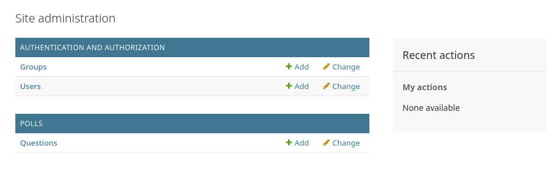
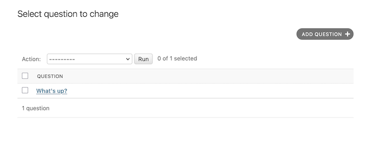
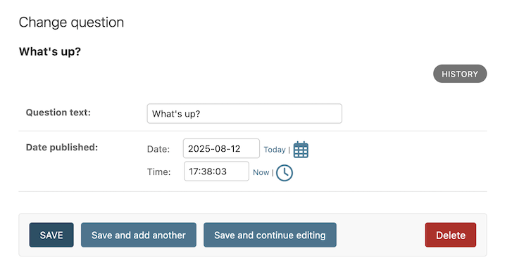

# Table of Contents <!-- omit in toc -->

- [1. Run the existing project](#1-run-the-existing-project)
- [2. Step by step guide from scratch (for Ubuntu or wsl)](#2-step-by-step-guide-from-scratch-for-ubuntu-or-wsl)
  - [2.1. Install python (if still not)](#21-install-python-if-still-not)
  - [2.2. Create venv (virtual environment)](#22-create-venv-virtual-environment)
  - [2.3. Install Django](#23-install-django)
  - [2.4. Create a django project](#24-create-a-django-project)
  - [2.5. Database setup for PostgreSQL](#25-database-setup-for-postgresql)
    - [2.5.1. Install `psycopg` package (https://github.com/psycopg/psycopg/)](#251-install-psycopg-package-httpsgithubcompsycopgpsycopg)
    - [2.5.2. Create database](#252-create-database)
      - [2.5.2.1. enter postgress psql shell](#2521-enter-postgress-psql-shell)
    - [2.5.3. Settings file](#253-settings-file)
    - [2.5.4. Environ variables](#254-environ-variables)
    - [2.5.5. Git commit](#255-git-commit)
  - [2.6. (Optional) TailwindCSS and DaisyUI setup for frontend (not for this project)](#26-optional-tailwindcss-and-daisyui-setup-for-frontend-not-for-this-project)
- [3. CREATING the Polls app](#3-creating-the-polls-app)
  - [3.1. Write your first view](#31-write-your-first-view)
  - [3.2. Creating models](#32-creating-models)
  - [3.3. Activating models](#33-activating-models)
  - [3.4. Playing with the API](#34-playing-with-the-api)
      - [3.4.0.1. Add custom method to model](#3401-add-custom-method-to-model)
      - [3.4.0.2. Back to shell](#3402-back-to-shell)
  - [3.5. Introducing the Django Admin](#35-introducing-the-django-admin)
    - [3.5.1. Creating an admin user](#351-creating-an-admin-user)
    - [3.5.2. Start the development server](#352-start-the-development-server)
    - [3.5.3. Enter the admin site](#353-enter-the-admin-site)
    - [3.5.4. Make the poll app modifiable in the admin](#354-make-the-poll-app-modifiable-in-the-admin)
    - [3.5.5. Explore the free admin functionality](#355-explore-the-free-admin-functionality)
  - [3.6. Django Views](#36-django-views)
    - [3.6.1. Overview](#361-overview)
    - [3.6.2. Writing more views](#362-writing-more-views)
    - [3.6.3. Write views that actually do something](#363-write-views-that-actually-do-something)
      - [3.6.3.1. A shortcut: `render()`](#3631-a-shortcut-render)
    - [3.6.4. Raising a 404 error](#364-raising-a-404-error)
      - [3.6.4.1. A shortcut: get\_object\_or\_404()](#3641-a-shortcut-get_object_or_404)
    - [3.6.5. Use the template system](#365-use-the-template-system)
    - [3.6.6. Removing hardcoded URLs in templates](#366-removing-hardcoded-urls-in-templates)
    - [3.6.7. Namespacing URL names](#367-namespacing-url-names)
  - [3.7. Write a minimal form](#37-write-a-minimal-form)
  - [3.8. Use generic views: Less code is better](#38-use-generic-views-less-code-is-better)
    - [3.8.1. Amend views](#381-amend-views)
    - [3.8.2. Amend URLconf](#382-amend-urlconf)

# 1. Run the existing project

- install dependencies

  **terminal**

  ```bash
  pip install -r requirements.txt
  ```

- run `migrate`

  **terminal**

  ```bash
  python manage.py migration
  ```

- run dev server

  ```bash
  python manage.py runserver
  ```

- Visit http://127.0.0.1:8000/polls/ to see the poll questions.

# 2. Step by step guide from scratch (for Ubuntu or wsl)

## 2.1. Install python (if still not)

- for ubuntu (wsl)

```bash
sudo apt update
sudo apt install python3 python3-pip python3-venv
```

## 2.2. Create venv (virtual environment)

- Create a venv inside the project directory

```bash
python3 -m venv .venv
```

- immediately add it to .gitignore file

.gitignore

```
.venv/
```

- Activate venv

```bash
source .venv/bin/activate
```

## 2.3. Install Django

```bash
python -m pip install django
pip freeze > requirements.txt
```

- To verify that Django can be seen by Python, type python from your shell. Then at the Python prompt, try
  to import Django:

```bash
python
>>> import django
>>> print(django.get_version())

//output
6.0.6

>>> exit()
```

- Or, run this while activating the venv

```bash
python -m django --version
```

## 2.4. Create a django project

```bash
django-admin startproject project_core .
```

- This will create a project named 'project_core' and 'manage.py' file inside the current directory
- (I will choose the name `config` instead of `project_core` next time)

- Run server to test if everything is okay

```bash
python manage.py runserver
```

- ignore the 'unapplied migration' warning for now.

## 2.5. Database setup for PostgreSQL

- Django comes with `sqlite` db by defalut. But if we want to setup big db engines like PostgreSql, we need to set it up.
- This can be done at the end, but recommended to do at the beginning to avoid any issue

### 2.5.1. Install `psycopg` package (https://github.com/psycopg/psycopg/)

- Install following packages in global system (not in venv)

```bash
sudo apt update
sudo apt install libpq5 libpq-dev python3-dev
```

- OR check if they are already instally (globally)

```bash
dpkg -l | grep -E 'libpq5|libpq-dev|python3-dev'
```

(`ii` - means installed)

- In the project's venv (activating venv), install following

```bash
pip install "psycopg[c,pool]"
pip freeze > requirements.txt
```

### 2.5.2. Create database

#### 2.5.2.1. enter postgress psql shell

open wsl

```bash
sudo -u postgres psql
```

Enter password for `sudo`

- Create db for an existing postgres user
- (DON'T FORGET SEMICOLON FOR POSTGRES SHELL COMMANDS)

```psql
CREATE DATABASE <db_name> OWNER <pg_username>;
```

This will grant all privileges to the user by default

- check if the db is created

```psql
\l
```

### 2.5.3. Settings file

- Install dj-database-url for convenience (https://pypi.org/project/dj-database-url/)

settings.py

```py
import dj_database_url

# modify
DATABASES = {
    "default": dj_database_url.config(
        default="postgres://<db_owner>:<owner_password>@<port>:5432/<db_name>",
        conn_max_age=600,
    )
}
```

- DELETE `db.sqlite3` file
- Run migrate and runserver. See if everything is okay

- For extra check, check if database tables (auth, etc.) are created.

```bash
psql -U <db_user> -d <db_name>
```

This tables are created based on INSTALLED_APPS listed in settings.py

### 2.5.4. Environ variables

- create .env file in the root

```
DEBUG=True
SECRET_KEY=<django_secret_key>
DATABASE_URL=postgres://<db_owner>:<owner_password>@<port>:5432/<db_name>
```

- immediately add .env to .gitignore file

- Generate secret key for django and add it to the .env file

```bash
python -c "import secrets; print(secrets.token_urlsafe(50))"
```

- Install `django-environ` in the venv:

```bash
pip install django-environ
pip freeze > requirements.txt
```

- Modify settings.py to use the envs

settings.py

```py
import environ
import os
from pathlib import Path

BASE_DIR = Path(__file__).resolve().parent.parent

# Initialize environ
env = environ.Env(
    # set casting, default value
    DEBUG=(bool, False)
)

# Read the .env file
environ.Env.read_env(os.path.join(BASE_DIR, '.env'))

# Use the variables
SECRET_KEY = env('SECRET_KEY')
DEBUG = env('DEBUG')

DATABASES = {
    'default': env.db(), # django-environ has dj-database-url built right in!
}
```

- Stop the server, run migrate and server. Check if everything is okay

### 2.5.5. Git commit

- As initial setups have completed, do your first commit (optionally push to a github repo)

## 2.6. (Optional) TailwindCSS and DaisyUI setup for frontend (not for this project)

<!-- ============================END INITIAL DJANGO SETUPS============================== -->

# 3. CREATING the Polls app

- To create your app, make sure you’re in the same directory as manage.py and type this command:

```bash
python manage.py startapp polls
```

That’ll create a directory `polls`

## 3.1. Write your first view

Open polls/views.py

```py
from django.http import HttpResponse

def index(request):
    return HttpResponse("Hello, world. You're at the polls index.")
```

This is the most basic view possible in django.

- To access it in a browser, we need to map it to a URL
- create polls/urls.py and open it

```py
from django.urls import path
from . import views

urlpatterns = [
    path("", views.index, name="index"),
]
```

- The next step is to configure the root URLconf in the project_core to include the URLconf defined in polls

project_core/urls.py

```py
from django.contrib import admin
from django.urls import include, path

urlpatterns = [
    path("polls/", include("polls.urls")), #new
    path("admin/", admin.site.urls),
]
```

- We have now wired an index view into the URLconf. Verify it’s working with the following command:

```bash
python manage.py runserver
```

- Go to http://localhost:8000/polls/ in your browser, and you should see the text defined in the index view.

## 3.2. Creating models

- defining models means defining database layout, with additional metadata.
- The goal is to define your data model in one place and automatically derive things from it.
  This includes the migrations
- In our poll app, we’ll create two models: Question and Choice. Each Choice is associated with a Question.

These concepts are represented by Python classes.

Edit the polls/models.py

```py
from django.db import models


class Question(models.Model):
    question_text = models.CharField(max_length=200)
    pub_date = models.DateTimeField("date published")


class Choice(models.Model):
    question = models.ForeignKey(Question, on_delete=models.CASCADE)
    choice_text = models.CharField(max_length=200)
    votes = models.IntegerField(default=0)
```

- Some Field classes have required arguments. `CharField`, for example, requires a `max_length`.
- That `ForeignKey` tells Django that each Choice is related to a single Question. Django supports all the common database relationships: many-to-one, many-to-many, and one-to-one.

## 3.3. Activating models

With django models, Django is able to:

- Create a database schema (CREATE TABLE statements) for this app.
- Create a Python database-access API for accessing Question and Choice objects.

`But first we need to tell our project that the polls app is installed.`

**Philosophy**

- Django apps are “pluggable”: You can use an app in multiple projects.

To include the app in our project, we need to edit the porject_core/settings.py file and add the dotted path of PollsConfig class to the INSTALLED_APPS setting:

**project_core/settings.py**

```py
INSTALLED_APPS = [
"polls.apps.PollsConfig", #new
"django.contrib.admin",
# others...
]
```

Now Django knows to include the polls app. Let’s run another command:

**terminal**

```bash
python manage.py makemigrations polls
```

- By running makemigrations, you’re telling Django that you’ve made some changes to your models and that you’d like the changes to be stored as a migration.
- new migration file created - `polls/migrations/0001_initial.py`.

**Note**

- you can run `python manage.py check` to check for any problems in your projects without making migrations or touching the database.

Now, run `migrate` to create those model tables in your database:

**terminal**

```bash
python manage.py migrate
```

The _migrate_ command takes all the migrations that haven’t been applied and synchronizes the changes you made to your models with the schema in the database.

**summary**

- Run `python manage.py makemigrations` to create migrations for changes
- Run `python manage.py migrate` to apply those changes to the database.

## 3.4. Playing with the API

Now, let’s hop into the interactive `Python shell`:

```bash
$ python manage.py shell
```

By default, the shell command automatically imports the models from your `INSTALLED_APPS`.
Once you’re in the shell, explore the `database API`:

```pycon
# No questions are in the system yet.
>>> Question.objects.all()
<QuerySet []>
# Create a new Question.
# Support for time zones is enabled in the default settings file, so
# Django expects a datetime with tzinfo for pub_date. Use timezone.now()
# instead of datetime.datetime.now() and it will do the right thing.
>>> from django.utils import timezone
>>> q = Question(question_text="What's new?", pub_date=timezone.now())
# Save the object into the database. You have to call save() explicitly.
>>> q.save()
# Now it has an ID.
>>> q.id
1
# Access model field values via Python attributes.
>>> q.question_text
"What's new?"
>>> q.pub_date
datetime.datetime(2012, 2, 26, 13, 0, 0, 775217, tzinfo=datetime.UTC)
# Change values by changing the attributes, then calling save().
>>> q.question_text = "What's up?"
>>> q.save()
# objects.all() displays all the questions in the database.
>>> Question.objects.all()
<QuerySet [<Question: Question object (1)>]>
```

**Add `__str__()` method to model**

Wait a minute. `<Question: Question object (1)>` isn’t a helpful representation of this object. Let’s fix
that by editing the `Question` model (in the `polls/models.py` file) and adding a `__str__()` method to both
`Question` and `Choice`:

`polls/models.py`

```py
from django.db import models

class Question(models.Model):
    # ...
    def __str__(self):
        return self.question_text

class Choice(models.Model):
    # ...
    def __str__(self):
        return self.choice_text
```

These objects’ representations are used throughout Django’s automatically-generated admin.

#### 3.4.0.1. Add custom method to model

Let’s also add a custom method to this model:

`polls/models.py`

```py
import datetime

from django.db import models
from django.utils import timezone

class Question(models.Model):
    # ...
    def was_published_recently(self):
        return self.pub_date >= timezone.now() - datetime.timedelta(days=1)
```

#### 3.4.0.2. Back to shell

If you are still in the shell, you need to exit first using `exit())`. Run `python manage.py shell` again to reload
the models.

```pycon
# Make sure our __str__() addition worked.
>>> Question.objects.all()
<QuerySet [<Question: What's up?>]>

# Django provides a rich database lookup API that's entirely driven by
# keyword arguments.
>>> Question.objects.filter(id=1)
<QuerySet [<Question: What's up?>]>
>>> Question.objects.filter(question_text__startswith="What")
<QuerySet [<Question: What's up?>]>

# Get the question that was published this year.
>>> from django.utils import timezone
>>> current_year = timezone.now().year
>>> Question.objects.get(pub_date__year=current_year)
<Question: What's up?>

# Request an ID that doesn't exist, this will raise an exception.
>>> Question.objects.get(id=2)
Traceback (most recent call last):
...
DoesNotExist: Question matching query does not exist.

# Lookup by a primary key is the most common case, so Django provides a
# shortcut for primary-key exact lookups.
# The following is identical to Question.objects.get(id=1).
>>> Question.objects.get(pk=1)
<Question: What's up?>

# Make sure our custom method worked.
>>> q = Question.objects.get(pk=1)
>>> q.was_published_recently()
True

# Give the Question a couple of Choices. The create call constructs a new
# Choice object, does the INSERT statement, adds the choice to the set
# of available choices and returns the new Choice object. Django creates
# a set (defined as "choice_set") to hold the "other side" of a ForeignKey
# relation (e.g. a question's choice) which can be accessed via the API.
>>> q = Question.objects.get(pk=1)

# Display any choices from the related object set -- none so far.
>>> q.choice_set.all()
<QuerySet []>

# Create three choices.
>>> q.choice_set.create(choice_text="Not much", votes=0)
<Choice: Not much>
>>> q.choice_set.create(choice_text="The sky", votes=0)
<Choice: The sky>
>>> c = q.choice_set.create(choice_text="Just hacking again", votes=0)

# Choice objects have API access to their related Question objects.
>>> c.question
<Question: What's up?>

# And vice versa: Question objects get access to Choice objects.
>>> q.choice_set.all()
<QuerySet [<Choice: Not much>, <Choice: The sky>, <Choice: Just hacking again>]>
>>> q.choice_set.count()
3

# The API automatically follows relationships as far as you need.
# Use double underscores to separate relationships.
# This works as many levels deep as you want; there's no limit.
# Find all Choices for any question whose pub_date is in this year
# (reusing the 'current_year' variable we created above).
>>> Choice.objects.filter(question__pub_date__year=current_year)
<QuerySet [<Choice: Not much>, <Choice: The sky>, <Choice: Just hacking again>]>
# Let's delete one of the choices. Use delete() for that.
>>> c = q.choice_set.filter(choice_text__startswith="Just hacking")
>>> c.delete()
```

## 3.5. Introducing the Django Admin

> [!NOTE]Philosophy
> Django entirely automates creation of admin interfaces for your staff or clients to add, change, and delete content for models.
>
> The admin isn’t intended to be used by site visitors. It’s for site managers.

### 3.5.1. Creating an admin user

First we’ll need to create a super user who can login to the admin site. Run the following command:

```bash
$ python manage.py createsuperuser
```

Enter your desired Username, Email address, and Password (twice) to create the superuser.

### 3.5.2. Start the development server

The Django admin site is activated by default. Let’s start the development server and explore it:

```bash
$ python manage.py runserver
```

Now, open a web browser and go to `/admin/` on your local domain – e.g., http://127.0.0.1:8000/admin/. You
should see the admin’s login screen.

> TIP: if you set `LANGUAGE_CODE`, the login screen will be displayed in the given language (if Django has appropriate translations)

### 3.5.3. Enter the admin site

Now, try logging in with the superuser account you created in the previous step. You should see the Django
admin index page.

You should see a few types of editable content: `Groups` and `Users`. They are provided by `django.contrib.
auth`, the authentication framework shipped by Django.

### 3.5.4. Make the poll app modifiable in the admin

But where’s our poll app? It’s not displayed on the admin index page.

Open the `polls/admin.py` file, and edit it to look like this:

```py
from django.contrib import admin
from .models import Question

admin.site.register(Question)
```

### 3.5.5. Explore the free admin functionality

Now that we’ve registered `Question`, Django knows that it should be displayed on the admin index page:



Click `Questions`. This page displays all the questions in the database and lets you choose one to change it:



Click the **What’s up?** question to edit it:



Things to note here:

- The form is automatically generated from the Question model.
- The different model field types (`DateTimeField`, `CharField`) correspond to the appropriate HTML input widget.
- Each `DateTimeField` gets free JavaScript shortcuts. Dates get a `Today` shortcut and calendar popup, and times get a `Now` shortcut and a convenient popup that lists commonly entered times.

The bottom part of the page gives you a couple of options:

`Save`, `Save and continue editing`, `Save and add another`, and `Delete`.

If the value of `Date published` doesn’t match the time when you created the question in Tutorial 1, it probably means you forgot to set the correct value for the `TIME_ZONE` setting.

Change the `Date published` by clicking the “Today” and “Now” shortcuts. Then click “Save and continue editing.” Then click `History` in the upper right. You’ll see a page listing all changes made to this object, with the timestamp and username.

## 3.6. Django Views

### 3.6.1. Overview

A view is a “type” of web page in your Django application that generally serves a specific function and has a specific template.

In our poll application, we’ll have the following four views:

- Question “index” page – displays the latest few questions.
- Question “detail” page – displays a question text, with no results but with a form to vote.
- Question “results” page – displays results for a particular question.
- Vote action – handles voting for a particular choice in a particular question.

In Django, web pages and other content are delivered by views. Each view is represented by a Python function (or method, in the case of class-based views). Django will choose a view by examining the URL that’s requested.

A URL pattern is the general form of a URL - for example: `/newsarchive/<year>/<month>/`.

To get from a URL to a view, Django uses what are known as `URLconfs`. A URLconf maps URL patterns to views.

This tutorial provides basic instruction in the use of URLconfs.

### 3.6.2. Writing more views

Now let’s add a few more views to `polls/views.py`. These views take an argument:

```py
def detail(request, question_id):
    return HttpResponse(f"You're looking at question {question_id}.")

def result(request, question_id):
    return HttpResponse(f"You're looking at the results of question {question_id}.")

def vote(request, question_id):
    return HttpResponse(f"You're voting on question {question_id}.")
```

Wire these new views into the `polls.urls` module by adding the following `path()` calls:

```py
# ....
urlpatterns = [
    # ex: /polls/
    path("", views.index, name="index"),
    # ex: /polls/5/
    path("<int:question_id>/", views.detail, name="detail"),
    # ex: /polls/5/results/
    path("<int:question_id>/results/", views.result, name="result"),
    # ex: /polls/5/vote/
    path("<int:question_id>/vote/", views.vote, name="vote"),
]
```

Using angle brackets “captures” part of the URL and sends it as a keyword argument to the view function.

Take a look in your browser, at `/polls/34/`. It’ll run the `detail()` view function and display whatever ID you provide in the URL. Try `/polls/34/results/` and `/polls/34/vote/` too – these will display the placeholder results and voting pages.

### 3.6.3. Write views that actually do something

Each view is responsible for doing one of two things: returning an `HttpResponse` object containing the content for the requested page, or raising an exception such as `Http404`. The rest is up to you.

Your view can read records from a database, or not. It can use a template system such as Django’s – or a third-party Python template system – or not. It can generate a PDF file, output XML, create a ZIP file on the fly, anything you want, using whatever Python libraries you want.

All Django wants is that `HttpResponse`. Or an exception.

Let's modify the `index()` view, which displays the latest 5 poll questions in the system, separated by commas, according to publication date:

`polls/views.py`

```py
from django.http import HttpResponse
from .models import Question

def index(request):
    latest_question_list = Question.objects.order_by("-pub_date")[:5]
    output = ", ".join([q.question_text for q in latest_question_list])
    return HttpResponse(output)
```

You can add more questions via admin site to see 5 questions on browser.

There’s a problem here, though: the page’s design is hardcoded in the view. If you want to change the way the page looks, you’ll have to edit this Python code. So let’s use Django’s template system to separate the design from Python by creating a template that the view can use.

First, create a directory called `templates` in your `polls` directory. Django will look for templates in there.

Your project’s `TEMPLATES` setting describes how Django will load and render templates. The default settings file configures a `DjangoTemplates` backend whose `APP_DIRS` option is set to True. By convention `DjangoTemplates` looks for a `templates` subdirectory in each of the `INSTALLED_APPS`.

Within the templates directory you have just created, create another directory called `polls`, and within that create a file called `index.html`. In other words, your template should be at `polls/templates/polls/index.html`. Because of how the `app_directories` template loader works as described above, you can refer to this template within Django as `polls/index.html`.

Put the following code in that template:

```django
<!DOCTYPE html>
<html lang="en">
  <head>
    <meta charset="UTF-8" />
    <meta name="viewport" content="width=device-width, initial-scale=1.0" />
    <title>Mysite</title>
  </head>
  <body>
    
    <ul>
      
      <li>
        <a href="/polls/{{ question.id }}/">{{ question.question_text }}</a>
      </li>
      
    </ul>
    
    <p>No polls are available.</p>
    
  </body>
</html>
```

Now let’s update our index view in polls/views.py to use the template:

`polls/views.py`

```py
from django.http import HttpResponse
from django.template import loader

from .models import Question

def index(request):
    latest_question_list = Question.objects.order_by("-pub_date")[:5]
    template = loader.get_template("polls/index.html")
    context = {"latest_question_list": latest_question_list}
    return HttpResponse(template.render(context, request))
```

That code loads the template called `polls/index.html` and passes it a context. The **context** is a dictionary mapping template variable names to Python objects.

Load the page by pointing your browser at “/polls/”, and you should see a bulleted-list containing the “What’s up” question from Tutorial 2. The link points to the question’s detail page.

#### 3.6.3.1. A shortcut: `render()`

It’s a very common idiom to load a template, fill a `context` and return an `HttpResponse` object with the result of the rendered template. Django provides a shortcut. Here’s the full `index()` view, rewritten:

`polls/views.py`

```py
from django.shortcuts import render

from .models import Question

def index(request):
    latest_question_list = Question.objects.order_by("-pub_date")[:5]
    context = {"latest_question_list": latest_question_list}
    return render(request, "polls/index.html", context)
```

The `render()` function takes the `request` object as its first argument, a **template name** as its second argument and a **dictionary** as its optional third argument. It returns an **HttpResponse** object of the given template rendered with the given context.

### 3.6.4. Raising a 404 error

Now, let’s tackle the question detail view – the page that displays the question text for a given poll. Here’s the view:

`polls/views.py`

```py
from django.http import Http404

# ...
def detail(request, question_id):
    try:
        question = Question.objects.get(pk=question_id)
    except Question.DoesNotExist:
        raise Http404("Question does not exist")

    return render(request, "polls/detail.html", {"question": question})
```

The new concept here: The view raises the `Http404` exception if a question with the requested ID doesn’t exist.

If you’d like to quickly view the above example working on browser, create the file `detail.html` in `polls/templates/polls` containing just:

```django
{{ question }}
```

#### 3.6.4.1. A shortcut: get_object_or_404()

It’s a very common idiom to use `get()` and raise `Http404` if the object doesn’t exist. Django provides a shortcut. Here’s the `detail()` view, rewritten:

`polls/views.py`

```py
from django.shortcuts import get_object_or_404, render

# ...
def detail(request, question_id):
    question = get_object_or_404(Question, pk=question_id)
    return render(request, "polls/detail.html", {"question": question})
```

> [!TIP]
> There’s also a `get_list_or_404()` function, which works just as `get_object_or_404()` – except using `filter()` instead of `get()`. It raises `Http404` if the list is empty.

### 3.6.5. Use the template system

Back to the `detail()` view. Given the context variable `question`, here’s what the `polls/detail.html` template might look like:

```django
<h1>{{ question.question_text }}</h1>
<ul>

    <li>{{ choice.choice_text }}</li>

</ul>
```

The template system uses dot-lookup syntax.

Method-calling happens in the `` loop: `question.choice_set.all` which returns an iterable of Choice objects.

### 3.6.6. Removing hardcoded URLs in templates

We wrote the link to a question in the `polls/index.html` template, was partially hardcoded like this:

```django
<li><a href="/polls/{{ question.id }}/">{{ question.question_text }}</a></li>
```

However, since you defined the name argument in the `path()` functions in the `polls.urls` module, you can remove a reliance on specific URL paths defined in your url configurations by using the `` template tag:

```py
<li><a href="">{{ question.question_text }}</a></li>
```

The way this works is by looking up the URL definition as specified in the `polls.urls` module where the URL name of ‘detail’ is also defined:

```py
...
# the 'name' value as called by the  template tag
path("<int:question_id>/", views.detail, name="detail"),
...
```

### 3.6.7. Namespacing URL names

The tutorial project has just one app, `polls`. In real Django projects, there might be five, ten, twenty apps or more. How does Django differentiate the URL names between them (if they use the same name)?

The answer is to add namespaces to your URLconf. In the `polls/urls.py` file, go ahead and add an `app_name` to set the application namespace:

```py
from django.urls import path

from . import views

app_name = "polls"
urlpatterns = [
    path("", views.index, name="index"),
    path("<int:question_id>/", views.detail, name="detail"),
    path("<int:question_id>/results/", views.results, name="results"),
    path("<int:question_id>/vote/", views.vote, name="vote"),
]
```

Now change your `polls/index.html` template from:

`polls/templates/polls/index.html`

```django
<li><a href="">{{ question.question_text }}</a></li>
```

to point at the namespaced detail view:

`polls/templates/polls/index.html`

```py
<li><a href="">{{ question.question_text }}</a></li>
```

> [!WARNING]
> After adding namespacing in URLconf, you must use them in ``. Otherwise you will get a `NoReverseMatch` error while browing the page.

## 3.7. Write a minimal form

Let’s update our poll detail template, so that the template contains an HTML `<form>` element:

`polls/templates/polls/detail.html`

```django
<form action="" method="post">

<fieldset>
    <legend><h1>{{ question.question_text }}</h1></legend>
    <p><strong>{{ error_message }}</strong></p>
    
        <input type="radio" name="choice" id="choice{{ forloop.counter }}" value="{{ choice.id }}">
        <label for="choice{{ forloop.counter }}">{{ choice.choice_text }}</label><br>
    
</fieldset>
<input type="submit" value="Vote">
</form>
```

A quick rundown:

- The value of each radio button is the associated question choice’s ID. The name of each radio button is "choice". That means, when somebody selects one of the radio buttons and submits the form, it’ll send the POST data `choice=#` where `#` is the ID of the selected choice. This is the basic concept of HTML forms.

- We set the form’s `action` to ``. Using `method="post"` (as opposed to `method="get"`) is very important, because the act of submitting this form will alter data server-side.

- `forloop.counter` indicates how many times the `for` tag has gone through its loop

- Since we’re creating a POST form, we need to worry about **Cross Site Request Forgeries**. Django comes with a helpful system for protecting against it. In short, all POST forms that are targeted at internal URLs should use the `` template tag.

Now, let’s create a Django view that handles the submitted data and does something with it. We've already created a URLconf for the polls application that includes this line:

`polls/urls.py`

```py
path("<int:question_id>/vote/", views.vote, name="vote"),
```

Let’s create a real `vote()` function. Add the following to `polls/views.py`:

```py
from django.db.models import F
from django.http import HttpResponse, HttpResponseRedirect
from django.shortcuts import get_object_or_404, render
from django.urls import reverse

from .models import Choice, Question


# ...
def vote(request, question_id):
    question = get_object_or_404(Question, pk=question_id)
    try:
        selected_choice = question.choice_set.get(pk=request.POST["choice"])
    except (KeyError, Choice.DoesNotExist):
        # Redisplay the question voting form.
        return render(
            request,
            "polls/detail.html",
            {
                "question": question,
                "error_message": "You didn't select a choice.",
            },
        )
    else:
        selected_choice.votes = F("votes") + 1
        selected_choice.save()
        # Always return an HttpResponseRedirect after successfully dealing
        # with POST data. This prevents data from being posted twice if a
        # user hits the Back button.
        # Don't forget the trailing `,` in args tuple
        return HttpResponseRedirect(reverse("polls:results", args=(question.id,)))
```

This code includes a few things:

- `request.POST` is a dictionary-like object that lets you access submitted data by key name. In this case, `request.POST['choice']` returns the `ID` of the selected `choice`, as a string. `request.POST` values are always strings.

- `request.POST['choice']` will raise `KeyError` if choice wasn’t provided in POST data. The above code checks for `KeyError` and redisplays the question form with an error message if `choice` isn’t given.

- `F("votes") + 1` instructs the database to increase the vote count by 1.

- After incrementing the choice count, the code returns an `HttpResponseRedirect` rather than a normal `HttpResponse`. `HttpResponseRedirect` takes a single argument: the URL to which the user will be redirected.

  As the Python comment above points out, you should always return an `HttpResponseRedirect` after successfully dealing with POST data.

- We are using the `reverse()` function in the `HttpResponseRedirect` constructor in this example. This function helps avoid having to hardcode a URL in the view function. In this case, this `reverse()` call will return a string like: `"/polls/3/results/"`

- `request` is an `HttpRequest` object.

The redirected URL will then call the 'results' view to display the final page. Let’s write that view:

`polls/views.py`

```py
from django.shortcuts import get_object_or_404, render

def results(request, question_id):
    question = get_object_or_404(Question, pk=question_id)
    return render(request, "polls/results.html", {"question": question})
```

This is almost exactly the same as the `detail()` view. The only difference is the template name. We’ll fix this redundancy later.

Now, create a `polls/results.html` template:

`polls/templates/polls/results.html`

```django
<h1>{{ question.question_text }}</h1>

<ul>

    <li>{{ choice.choice_text }} -- {{ choice.votes }} vote{{ choice.votes|pluralize }}</li>

</ul>

<a href="">Vote again?</a>
```

Now, go to `/polls/1/` in your browser and vote in the question. You should see a results page that gets updated each time you vote. If you submit the form without having chosen a choice, you should see the error message.

## 3.8. Use generic views: Less code is better

The `detail()` and `results()` views are very short – and, as mentioned above, redundant. The `index()` view, which displays a list of polls, is similar.

These views represent a common case of basic web development: getting data from the database according to a parameter passed in the URL, loading a template and returning the rendered template. Because this is so common, Django provides a shortcut, called the `“generic views”` system.

Generic views abstract common patterns to the point where you don’t even need to write Python code to write an app. For example, the `ListView` and `DetailView` generic views abstract the concepts of “display a list of objects” and “display a detail page for a particular type of object” respectively.

Let’s convert our poll app to use the generic views system. We’ll have to take a few steps to make the conversion. We will:

1. Delete some of the old, unneeded views.
2. Introduce new views based on Django’s generic views.
3. Convert the URLconf.

### 3.8.1. Amend views

First, we’re going to remove our old index, detail, and results views and use Django’s generic views instead.

`polls/views.py`

```py
from django.db.models import F
from django.http import HttpResponseRedirect
from django.shortcuts import get_object_or_404, render
from django.urls import reverse
from django.views import generic

from .models import Choice, Question


class IndexView(generic.ListView):
    template_name = "polls/index.html"
    context_object_name = "latest_question_list"

    def get_queryset(self):
        """Return the last five published questions."""
        return Question.objects.order_by("-pub_date")[:5]


class DetailView(generic.DetailView):
    model = Question
    template_name = "polls/detail.html"


class ResultsView(generic.DetailView):
    model = Question
    template_name = "polls/results.html"


def vote(request, question_id):
    # same as above, no changes needed.
    ...
```

Each generic view needs to know what model it will be acting upon. This is provided using either the `model` attribute (here, `model = Question` for `DetailView` and `ResultsView`) or by defining the `get_queryset()` method (as in `IndexView`).

By default, the `DetailView` generic view uses a template called `<app name>/<model name>\_detail.html`. The `template_name` attribute is used to tell Django to use a specific custom template name.

Similarly, the `ListView` generic view uses a default template called `<app name>/<model name>\_list.html`; we use `template_name` to tell `ListView` to use our existing `"polls/index.html"` template.

Our templates already have been provided with a context that contains the `question` and `latest_question_list` context variables. For `DetailView` the `question` variable is provided automatically – since we’re using a Django model (`Question`). However, for `ListView`, the automatically generated context variable is `question_list`. To override this we provide the `context_object_name` attribute.

### 3.8.2. Amend URLconf

Now, open the `polls/urls.py` URLconf and change it like so:

```py
from django.urls import path

from . import views

app_name = "polls"
urlpatterns = [
    path("", views.IndexView.as_view(), name="index"),
    path("<int:pk>/", views.DetailView.as_view(), name="detail"),
    path("<int:pk>/results/", views.ResultsView.as_view(), name="results"),
    path("<int:question_id>/vote/", views.vote, name="vote"),
]

```

Note that in the path strings of the second and third patterns has changed from `<question_id>` to `<pk>`. This is necessary because we’ll use the `DetailView` generic view, and it expects the primary key value captured from the URL to be called `"pk"`.

Run the server, and use your new polling app based on generic views.
